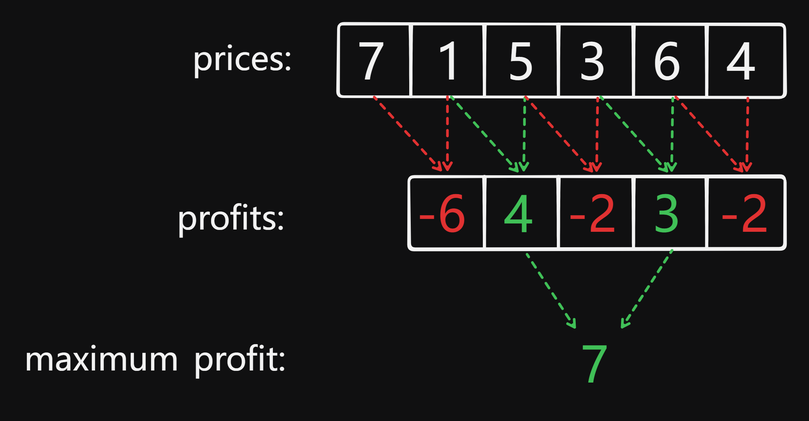
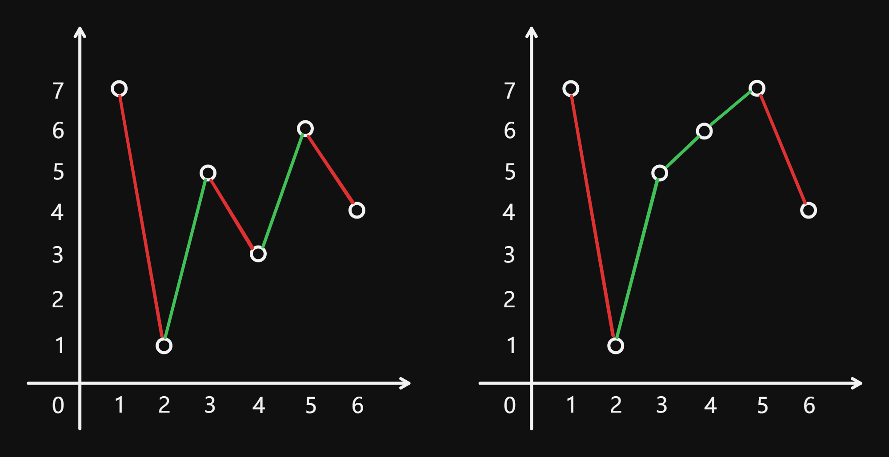

# 122 Best Time to Buy and Sell Stock II

Created: August 27, 2024 11:55 AM
Difficulty: Medium
Topics: Array, Greedy

## 📖Description

[Best Time to Buy and Sell Stock II](https://leetcode.com/problems/best-time-to-buy-and-sell-stock-ii/description/)

## 🤔Intuition

Different from [121 Best Time to Buy and Sell Stock](https://leetcode.com/problems/best-time-to-buy-and-sell-stock/description), this problem allows us to perform operations of buying and selling a stock many times. In order to achieve the maximum profit, we will greedily seize every buying and selling opportunity that can generate returns. Therefore, using Greedy Algorithm is very suitable for this problem.

## 📋Approach

Before we start trading stocks, we need to remember two premises:

1. We  can only hold at most one share of the stock at any time, which means that once we decide to sell, we will no longer hold any shares.
2. No transaction fee will be charged for each transaction.

Therefore, the optimal buying and selling interval is to buy today and sell tomorrow.

Now, all we need to do is to find out all the opportunity that can generate returns and accumulate the profits each time.

### Illustration



If the above illustration is not intuitive enough, we can convert it into a simple stock index chart.



Among them, the left illustration corresponds to the example given in the previous figure, and the right one is to illustrate another situation.

Now, we are sure that as long as each buying and selling operation is in the incremental interval of the stock index chart, we can obtain the maximum profit.

### Approach Steps

- Initialize a variable `maxProfit` to 0 for recording current maximum profit we obtain.
- Iterates through the array starting from the second element (index 1).
    - If the operation interval can generate returns, accumulate the current profit `prices[i] - prices[i - 1]` and `maxProfit` .
- Return the `maxProfit` value.

## 📊Complexity

- **Time complexity:** $O(N)$
- **Space complexity:** $O(1)$

## 🧑🏻‍💻Code

```tsx
function maxProfit(prices: number[]): number {
    let maxProfit: number = 0;

    for (let i = 1; i < prices.length; ++i) {
        maxProfit += Math.max(prices[i] - prices[i - 1], 0);
    }

    return maxProfit;
}
```

## 🔖Reference

1. [https://programmercarl.com/0122.买卖股票的最佳时机II.htm](https://programmercarl.com/0122.%E4%B9%B0%E5%8D%96%E8%82%A1%E7%A5%A8%E7%9A%84%E6%9C%80%E4%BD%B3%E6%97%B6%E6%9C%BAII.htm)