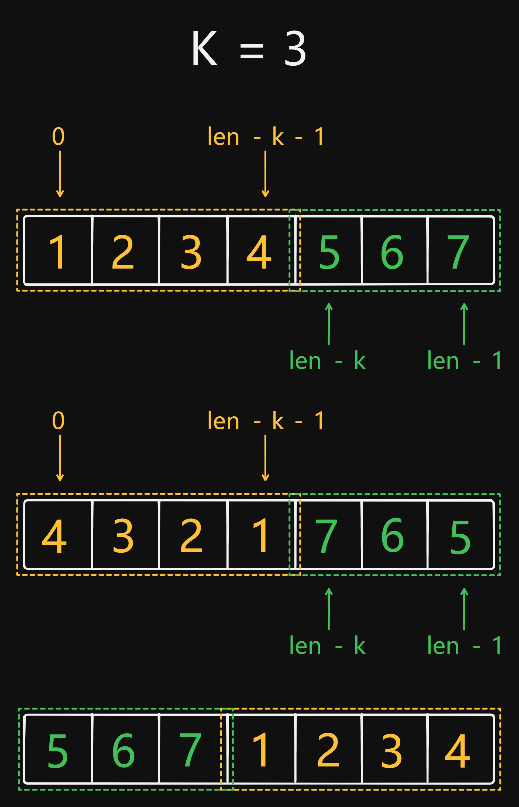

# 189 Rotate Array

Created: August 26, 2024 5:52 PM
Difficulty: Medium
Topics: Array, Two-Pointers

## 📖Description

[Rotate Array](https://leetcode.com/problems/rotate-array/description)

## 🤔Intuition

To solve this problem, the first thought that comes to mind is to take out an element from the end of the given array `nums` and insert it into the the beginning of this array each time. However, this approach may cause a large number of element movements. More efficient approaches will be provided later.

## 📋Approach One

For the Intuition approach, we only need to use two built-in `String` APIs, `pop()` and `unshift()` .

## 📊Complexity

- **Time complexity:** $O(K*N)$
- **Space complexity:** $O(N)$

## 🧑🏻‍💻Code

```tsx
function rotate(nums: number[], k: number): void {
    while (k--) {
        nums.unshift(nums.pop()!);
    }
}
```

## 📋Approach Two

### **Illustration**



### Approach Steps

By observing the process of array rotation, we can find that only three reversion are needed to obtain the desired rotated array. But we need to implement a helper function `reverseSegment(start, end)` to reverse the elements within a range of indices in the given array `nums` .

```tsx
const reverseSegment = (start: number, end: number): void => {
        while (start < end) {
            [nums[start++], nums[end--]] = [nums[end], nums[start]];
        }
    };
```

> Of particular note is the value of `k` may be greater than the length of the array, so it is necessary to calculate the true array index corresponding to `k` by `k %= nums.length` , which may be the reason for the low pass rate of this question.
> 

Step by step breakdown:

- Implement the helper function `reverseSegement(start, end)` .
- Calculate the true array index corresponding to `k` by `k %= nums.length` .
- Use `reverseSegment` to reverse the sub-array which range of indices is 0 to `len - k - 1` .
- Use `reverseSegment` to reverse the sub-array which range of indices is `len - k` to `len - 1` .
- Use `nums.reverse()` to reverse the entire array.

## 📊Complexity

- **Time complexity:** $O(N)$
- **Space complexity:** $O(1)$

## 🧑🏻‍💻Code

```tsx
function rotate(nums: number[], k: number): void {
    const len: number = nums.length;
    const reverseSegment = (start: number, end: number): void => {
        while (start < end) {
            [nums[start++], nums[end--]] = [nums[end], nums[start]];
        }
    };

    k %= len;

    reverseSegment(0, len - k - 1);
    reverseSegment(len - k, len - 1);
    nums.reverse();
}
```

## 📋Approach Three

This approach is essentially the same as the Approach One, with the main difference being that this approach does not require frequent changes to the length of the original array `nums` , but requires the creation of an additional temporary array `tempArr` to store the rotated array.

## 📊Complexity

- **Time complexity:** $O(N)$
- **Space complexity:** $O(N)$

## 🧑🏻‍💻Code

```tsx
function rotate(nums: number[], k: number): void {
    const len: number = nums.length;
    const tempArr: number[] = new Array(len).fill(0);

    k %= len;

    for (let i = 0; i < len; ++i) {
        tempArr[(i + k) % len] = nums[i];
    }

    for (let i = 0; i < len; ++i) {
        nums[i] = tempArr[i];
    }
}
```

## 🔖Reference

1. [https://leetcode.com/problems/rotate-array/solutions/5550096/video-using-remainder-with-3-solutions/](https://leetcode.com/problems/rotate-array/solutions/5550096/video-using-remainder-with-3-solutions/)