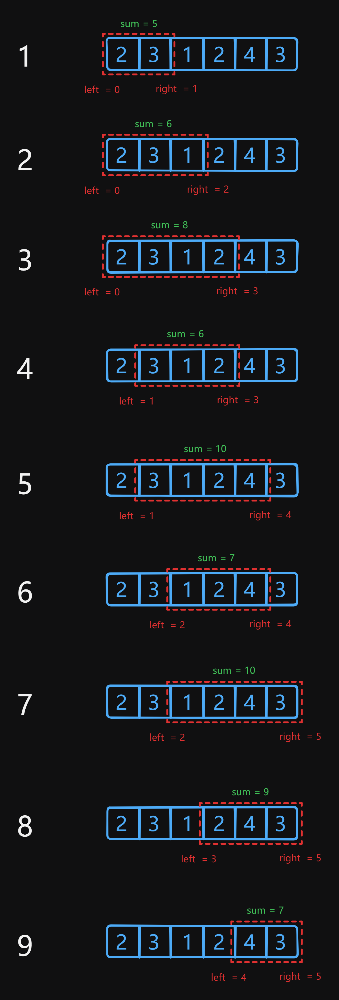
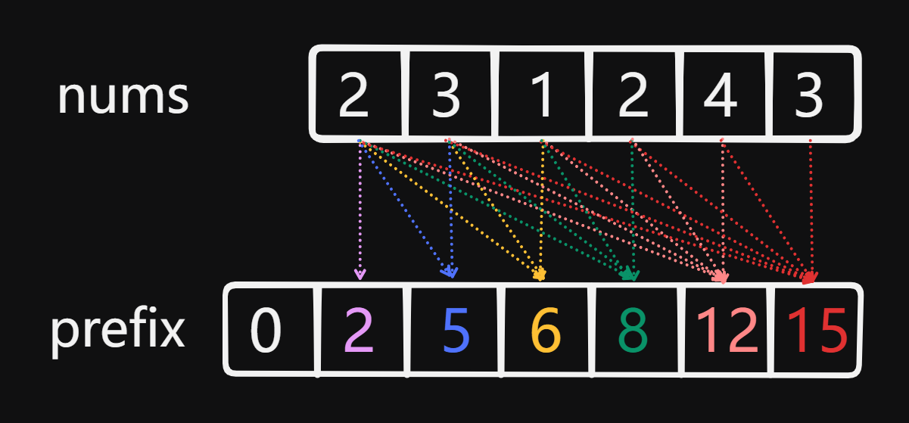

# 209 Minimum Size Subarray Sum

Created: July 15, 2024 4:16 PM
Select: Medium
Topics: Array, Binary-Search, Two-Pointers

## 📖Description

[Minimum Size Subarray Sum](https://leetcode.com/problems/minimum-size-subarray-sum/description)

## 🤔Intuition

We can use a Sliding Window approach to tackle this problem. The Sliding Window Technique **is** a type of Two-Pointers Technique which involves expanding the window constructed from two pointers `left` and `right` by adding elements from the given array `nums` until the sum is greater than or equal to `target` , then shrinking the window from the `left` to find the subarray which has the minimal length.

## 📋Approach One

### Illustration



### Sliding Window Approach

- Initialize two pointers `left` and `right` , represent the current window.
- The window keeps track of the current `sum` of elements in the subarray.
- Start a for loop that continues until `right` pointer reaches the length of `nums` .
- Update the `sum` by adding element at index `right` inside the loop.
- If the `sum` is greater than or equal to `target` , enter a while loop to update the `result` by comparing current `result` and current length of subarray `right - left + 1` , which one is smaller.

## 📊Complexity

- **Time complexity:** $O(N)$
- **Space complexity: $O(1)$**

## 🧑🏻‍💻Code

```tsx
function minSubArrayLen(target: number, nums: number[]): number {
    let result: number = Infinity;
    let sum: number = 0;

    for (let left = 0, right = 0; right < nums.length; ++right) {
        sum += nums[right];

        while (sum >= target) {
            result = Math.min(result, right - left + 1);
            sum -= nums[left++];
        }
    }

    return result === Infinity ? 0 : result;
}
```

## 📋Approach Two

Following up the problem, we can coding another solution of which the time complexity is $O(NlogN)$ base on Binary Search Technique.

### Initialization

Before entering the binary search process, we need to transform the given array to a sorted array. Considering that the purpose of the problem is to find a subarray whose `sum` of elements meets the condition, we are going to create an array `prefix` to record the sum of any subarray in `nums` .

```tsx
const len: number = nums.length;
const prefix: number[] = new Array(len + 1).fill(0);
for (let i = 1; i < prefix.length; ++i) {
    prefix[i] = prefix[i - 1] + nums[i - 1];
}
```

> The reason why the length of `prefix` is initialized by `nums.length + 1` is for simplify calculations. For example, if we want to calculate the sum of subarray from `nums[0]` to `nums[2]` , it can be easily found using `prefix[2] - prefix[0]` .
> 



### Binary Search Technique

**Iterate over all elements of the given** `nums` **:**

- Initialize two pointer `left` and `right` , in which `left` has an initial value of  `start + 1` and `right` has an initial value of `prefix.length` .
- Find the middle index `mid` , then compare whether the sum of current subarray `prefix[mid] - prefix[start]` is greater than or equal to the `target` .
    - If `true` , update the `result` and the `right` pointer, then the `left` is used for next search, else update the `left` and the `right` is used for next search.
- This process is continued until  the `left` is not longer less than `right` , indicates the total search space is exhausted.

> Once the subarray whose sum is greater than or equal to `target` is found, the search process will not immediately terminate, because we need to find out all the possible subarray and only choose the minimal length one.
> 

## 📊Complexity

- **Time complexity:** $O(NlogN)$
- **Space complexity: $O(1)$**

## 🧑🏻‍💻Code

```tsx
function minSubArrayLen(target: number, nums: number[]): number {
    const len: number = nums.length;
    const prefix: number[] = new Array(len + 1).fill(0);
    const prefixLen: number = prefix.length;
    
    for (let i = 1; i < prefixLen; ++i) {
        prefix[i] = prefix[i - 1] + nums[i - 1];
    }

    let result: number = Infinity;
    let start: number = 0;

    while (start < len) {
        let left: number = start + 1;
        let right: number = prefixLen;

        while (left < right) {
            const mid: number = left + ((right - left) >> 1);

            if (prefix[mid] - prefix[start] >= target) {
                result = Math.min(result, mid - start);
                right = mid;
            } else {
                left = mid + 1;
            }
        }
        
        ++start;
    }

    return result === Infinity ? 0 : result;
}
```

## 🔖Reference

1. [https://leetcode.com/problems/minimum-size-subarray-sum/solutions/5430625/java-solution-o-n-log-n/](https://leetcode.com/problems/minimum-size-subarray-sum/solutions/5430625/java-solution-o-n-log-n/)
2. [https://leetcode.com/problems/minimum-size-subarray-sum/solutions/5444156/minimum-length-subarray-sum-solution/](https://leetcode.com/problems/minimum-size-subarray-sum/solutions/5444156/minimum-length-subarray-sum-solution/)
3. [https://www.geeksforgeeks.org/window-sliding-technique/](https://www.geeksforgeeks.org/window-sliding-technique/)
4. [https://medium.com/技術筆記/演算法筆記系列-two-pointer-與sliding-window-8742f45f3f55](https://medium.com/%E6%8A%80%E8%A1%93%E7%AD%86%E8%A8%98/%E6%BC%94%E7%AE%97%E6%B3%95%E7%AD%86%E8%A8%98%E7%B3%BB%E5%88%97-two-pointer-%E8%88%87sliding-window-8742f45f3f55)
5. [https://programmercarl.com/0209.长度最小的子数组.html#思路](https://programmercarl.com/0209.%E9%95%BF%E5%BA%A6%E6%9C%80%E5%B0%8F%E7%9A%84%E5%AD%90%E6%95%B0%E7%BB%84.html#%E6%80%9D%E8%B7%AF)