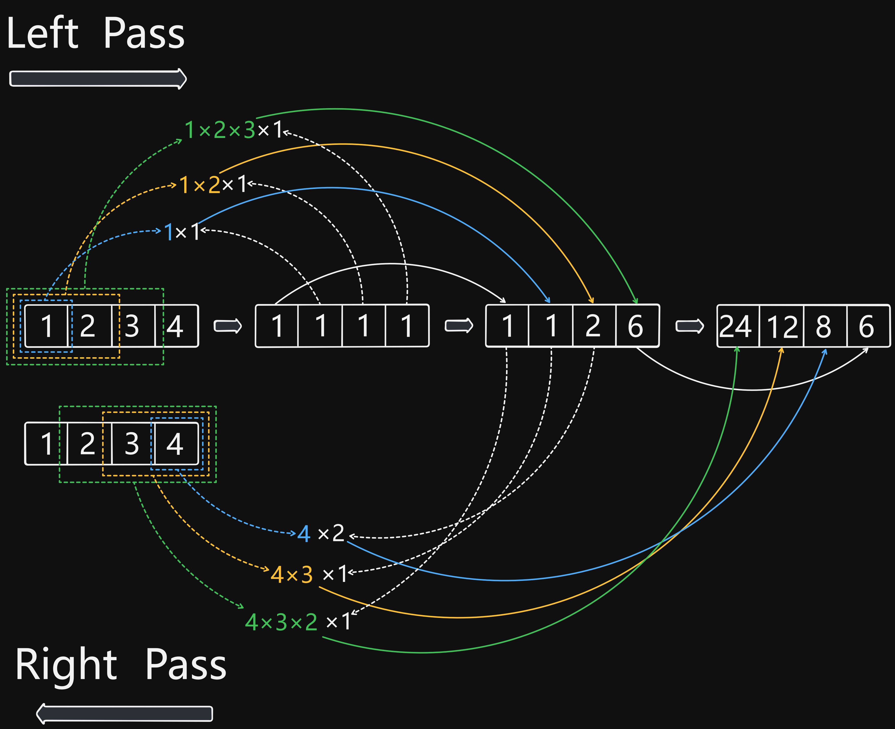

# 238 Product of Array Except Self

Created: August 30, 2024 12:11 PM
Difficulty: Medium
Topics: Array
Status: Done

## 📖Description

[Product of Array Except Self](https://leetcode.com/problems/product-of-array-except-self/description)

## 🤔Intuition

This problem requires us to return a new array where each element is the product of all element in the original array `nums` except the element at the current index.

## 📋Approach One

One brute method is to calculate the product `answer[i]` while iterating over the array, but it will run in $O(N^2)$ time complexity, not meeting the requirements of $O(N)$.

## 📊Complexity

- **Time Complexity:** $O(N^2)$
- **Space Complexity:** $O(1)$

## 🧑🏻‍💻Code

```tsx
function productExceptSelf(nums: number[]): number[] {
    return nums.map((_num, index, arr) =>
        arr.reduce((acc, cur, idx) => (idx === index ? acc : acc * cur), 1)
    );
}
```

## 📋Approach Two

For optimizing the implementation, we can calculate the product of all element first `product` , then only one iteration needed that we can get the product `answer[i]` from `product / nums[i]` . And the crux of this approach is how to handle the zero conditions correctly.

But in this approach, division is used, which also does not meet the requirements of the problem.

### Zero Conditions Handle

There are three zero conditions:

1. Zero does not exist in the original array `nums` .
    
    We can get all product `answer[i]` from `product / nums[i]` . 
    
2. Only one zero concluded in the original array `nums` .
    
    We can only get the product `answer[i]`of zero element from `product / nums[i]`  , and all others are zero.
    
3. More than two zero concluded in the original array `nums` .
    
    Every product `answer[i]` will be zero.
    

### Step By Step Breakdown

- Initialize a new array `result` which has the same length of given `nums` , and filled with zero.
- Reduce array `nums` to calculate `product` and `zeroCnt` .
- If `zeroCnt` is equal to `1` , it means that there is exactly one zero in the `nums` .
    - Return the `result` which every element will be `0` except at the index where `nums[i]` is `0` . For this index, the result will be the `product` .
- Else if `zeroCnt` is equal to `0` , it means that there are no zeros in the `nums` .
    - Return the `result` which every element will be `product / nums[i]` .
- Otherwise, there are more than one zero in the `nums` , it means that all the element in `result` will be `0` .

## 📊Complexity

- **Time Complexity:** $O(N)$
- **Space Complexity:** $O(N)$

## 🧑🏻‍💻Code

```tsx
function productExceptSelf(nums: number[]): number[] {
    const len: number = nums.length;
    const result: number[] = new Array(len).fill(0);
    const { product, zeroCnt } = nums.reduce(
        (acc, cur) => {
            let { product, zeroCnt } = acc;
            if (cur === 0) {
                ++zeroCnt;
            } else {
                product *= cur;
            }

            return { product, zeroCnt };
        },
        { product: 1, zeroCnt: 0 }
    );

    if (zeroCnt === 1) {
		    // We can get all product answer[i] from product / nums[i].
        return nums.reduce(
            (acc, cur, idx) => (cur === 0 ? ((acc[idx] = product), acc) : acc),
            result
        );
    } else if (zeroCnt === 0) {
		    // We can get all product answer[i] from product / nums[i]. 
        return nums.reduce(
            (acc, cur, idx) => ((acc[idx] = Math.floor(product / cur)), acc),
            result
        );
    }

		// More than two zero concluded in the original array nums.
		// Every product answer[i] will be zero.
    return result;
}
```

## 📋Optimized Approach

To implement the `productExceptSelf` function without using division operation and ensuring it runs in $O(N)$ time, we can solve this using two passes:

- **Left Pass:** Compute the cumulative product from the left side for each element.
- **Right Pass:** Compute the cumulative product from the right side for each element.

We combine the results of the left and right passes to get the final result.

### Illustration



### Step By Step Breakdown

- Initialize a new array `result` which has the same length of given `nums` , and filled with `1` .
- Reduce array `nums` from left to right,
    - The `acc` which initialized to `1` is to keep track of the product of all elements to the left of the current index.
    - Update the `result[index]` to `result[index] * acc` .
    - Update the `acc` by multiplying it by current element `curr` .
- Reduce array `nums` from right to left,
    - The `acc` which initialized to `1` is to keep track of the product of all elements to the right of the current index.
    - Update the cumulative product from the left side of current index `result[index]` by multiplying it by `acc` .
    - Update the `acc` by multiplying it by current element `curr` .
- Return the array `result` .

## 📊Complexity

- **Time Complexity:** $O(N)$
- **Space Complexity:** $O(N)$

## 🧑🏻‍💻Code

```tsx
function productExceptSelf(nums: number[]): number[] {
    const result: number[] = new Array(nums.length).fill(1);

    nums.reduce((acc, curr, index) => {
        result[index] *= acc;
        acc *= curr;

        return acc;
    }, 1);
    nums.reduceRight((acc, curr, index) => {
        result[index] *= acc;
        acc *= curr;

        return acc;
    }, 1);

    return result;
}
```

## 🔖Reference

1. [https://leetcode.com/problems/product-of-array-except-self/solutions/4877147/creative-approach-focus-on-the-number-of-zeros-time-o-n-space-o-1](https://leetcode.com/problems/product-of-array-except-self/solutions/4877147/creative-approach-focus-on-the-number-of-zeros-time-o-n-space-o-1)
2. [https://leetcode.com/problems/product-of-array-except-self/solutions/3186745/best-c-3-solution-dp-space-optimization-brute-force-optimize-one-stop-solution](https://leetcode.com/problems/product-of-array-except-self/solutions/3186745/best-c-3-solution-dp-space-optimization-brute-force-optimize-one-stop-solution)