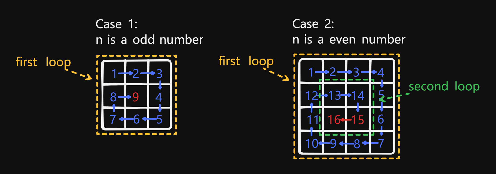

# 59 Spiral Matrix II

Created: August 21, 2024 2:34 PM
Difficulty: Medium
Topics: Array, Matrix, Simulation

## 📖Description

[Spiral Matrix II](https://leetcode.com/problems/spiral-matrix-ii/description/)

## 🤔Intuition

This question seems to be the reverse process of the  [54 Spiral Matrix](https://leetcode.com/problems/spiral-matrix/description/) , but according to the question, the rows and columns of the matrix are the same, which reduces the conditions that need to be considered in the simulation process.

## 📋Approach

### Two Types Of Filling Processes

According to the problem, the element filling order of each loop in the spiral matrix is:

1. From left to right.
2. From top to bottom.
3. From right to left.
4. From bottom to top.

However, not every matrix can completely execute these four steps in the final iteration loop. 

- If the given `n` is a odd number, after completing the final loop, it is necessary to fill the element at the last position of the matrix.
- If the given `n` is a even number, the final iteration will only proceed to the third step.



### Approach Steps

- Initialize a `n * n` matrix.
- Initialize variables to keep track of the boundaries of the iteration process.
    - `loopNum` is times of iterations.
    - `startX` and `startY` is used to mark the first element position of the matrix (located in the upper left corner) in each iteration
    - `offset` is used to calculate the row `startX + offset` and column `startY + offset` of the matrix in each iteration.
    - The description of other variables is omitted.
- Start a `while` loop that continues till `loopNum` is equal to 0.
    - Set `x` and `y` to `StartX` and `StartY` respectively.
    - Fill elements in the matrix according to the filling order.
    - Update the `StartX` , `StartY` for marking the first element position of the sub-matrix and set `offSet` to `offSet - 2` for assisting in calculate the row and column in the next iteration.
- If `n` is a odd number, fill the element at the last position `(startX, startY)` of the matrix.

## 📊Complexity

- **Time complexity:** $O(N^2)$
- **Space complexity:** $O(N^2)$

## 🧑🏻‍💻Code

```tsx
function generateMatrix(n: number): number[][] {
    const matrix: number[][] = new Array(n).fill(0).map((_) => new Array(n));

    let loopNum: number = n >> 1;
    let offset: number = n - 1;
    let startX: number = 0;
    let startY: number = 0;
    let value: number = 1;
    let x: number = 0;
    let y: number = 0;

    while (loopNum--) {
        x = startX;
        y = startY;

        while (y < startY + offset) {
            matrix[x][y++] = value++;
        }

        while (x < startX + offset) {
            matrix[x++][y] = value++;
        }

        while (y > startY) {
            matrix[x][y--] = value++;
        }

        while (x > startX) {
            matrix[x--][y] = value++;
        }

        ++startX;
        ++startY;
        offset -= 2;
    }

    if (n % 2) {
        matrix[startX][startY] = value;
    }

    return matrix;
}
```

## 🔖Reference

1. [https://programmercarl.com/0059.螺旋矩阵II.html](https://programmercarl.com/0059.%E8%9E%BA%E6%97%8B%E7%9F%A9%E9%98%B5II.html)