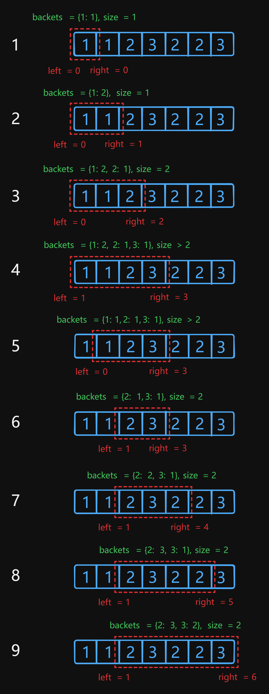

# 904 Fruit Into Baskets

Created: July 16, 2024 7:54 PM
Difficulty: Medium
Topics: Array, Hash Table, Sliding Window

## 📖Description

[Fruit Into Baskets](https://leetcode.com/problems/fruit-into-baskets/description/)

## 🤔Intuition

In short, the description of this problem is to find the longest subarray which has only two unique elements.

## 📋Approach

### Illustration



### Sliding Window Approach

- Initialize two pointers `left` and `right` , represent the current window.
- The window keeps track of the current number of elements in the picked fruits .
- Start a `for` loop that continues until the `right` pointer reaches the end of `fruits` .
    - Update the `backets` by adding the current fruit `fruits[right]` inside the loop.
    - If the number of elements in the `backets` is greater than 2, enter a `while` loop, then subtract the value of element whose key is `left` in the `backets` by one in each loop.
        - If the value of element with `left` key is equal to 0, then delete the element from the `backets` ,
        - Otherwise, continue the loop.
        - At the end of this loop, update the `left` pointer by `++left` to shrink the window for keeping the length of the backets `backets.size` no more than 2.
    - Update the `result` by comparing current `result` and current length of subarray `right - left + 1` , which one is smaller, then let the `right` pointer slide to the next index.

## 📊Complexity

- **Time complexity:** $O(N)$
- **Space complexity:** $O(1)$

## 🧑🏻‍💻Code

```tsx
function totalFruit(fruits: number[]): number {
    const fruitsLen: number = fruits.length;
    const backets: Map<number, number> = new Map();

    let result: number = 0;

    for (let left = 0, right = 0; right < fruitsLen; ++right) {
        const rightFruit: number = fruits[right];

        backets.set(rightFruit, (backets.get(rightFruit) ?? 0) + 1);

        while (backets.size > 2) {
            const leftFruit: number = fruits[left];

            backets.set(leftFruit, backets.get(leftFruit)! - 1);

            if (backets.get(leftFruit) === 0) {
                backets.delete(leftFruit);
            }

            ++left;
        }

        result = Math.max(result, right - left + 1);
    }

    return result;
}
```

## 🔖Reference

None.