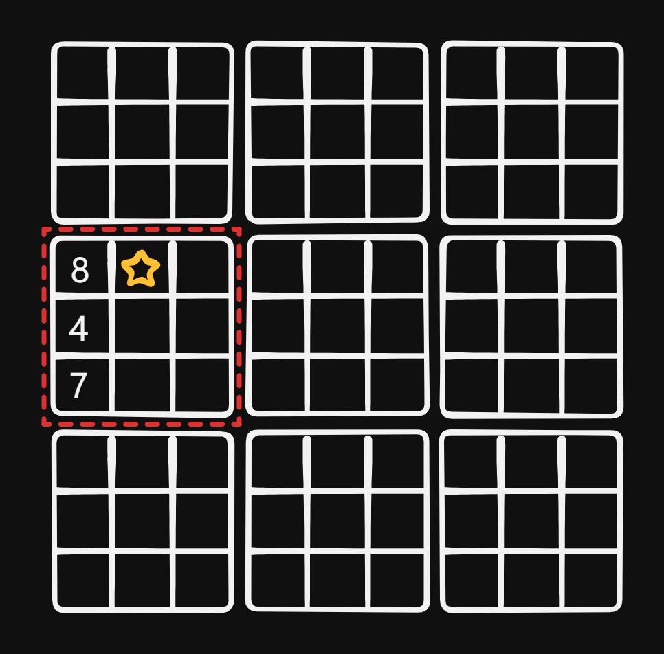

# 37 Sudoku Solver

Created: July 12, 2024 5:54 PM
SelDifficultyect: Hard
Topics: Backtracking, Hash Table

## 📖Description

[Sudoku Solver](https://leetcode.com/problems/sudoku-solver/description/)

## 🤔Intuition

The Sudoku puzzle can be solved using backtracking approach to explore all possible configurations  of Sudoku board until a valid solution is found. For the constraints of filling empty cells, we can easily understand from the question description.

## 📋Approach

### Validation Check

We will only focus on the third constraint checking:

- Each of the digits `1-9` must occur exactly once in each of the 9 `3x3` sub-boxes of the grid.
    
    
    

To check the validation of digit’s sub-box, we first need to figure out the coordinate of the top left corner of this sub-box by the coordinate of digit `(row, col)` .

```tsx
const subBoxTop: number = Math.floor(row / 3) * 3;
const subBoxLeft: number = Math.floor(col / 3) * 3;
```

**We can implement a helper function** `isValid(row, col, digit)` **:**

```tsx
const isValid = (row: number, col: number, digit: string): boolean => {
    const subBoxTop: number = Math.floor(row / 3) * 3;
    const subBoxLeft: number = Math.floor(col / 3) * 3;

    for (let i = 0; i < 9; i++) {
        if (
            board[i][col] === digit ||
            board[row][i] === digit ||
            board[subBoxTop + Math.floor(i / 3)][subBoxLeft + (i % 3)] ===
                digit
        ) {
            return false;
        }
    }

    return true;
};
```

### **Recursive Backtracking**

**Implement a recursive function** `backtrack()` **:**

- Using nested loop to iterate over each cell of the board.
  - If current cell `board[row][col]` is `'.'` , indicates it’s empty, and we can try place each `digit` from 1 to 9 in that cell.
  - For each possible `digit` , if `isValid(row, col, digit)` is `true` , means this `digit` is allow to be place this cell.
  - Recursively call `backtrack` to proceed to the next cell, if the return is `true` , indicates the board is completely filled correctly. If the return is `false` , illustrates there is no valid solution in this board.

## 📊Complexity

- **Time complexity:** $O(9^{N*M})$
- **Space complexity:** $O(1)$

## 🧑🏻‍💻Code

```tsx
function solveSudoku(board: string[][]): void {
    const height: number = board.length;
    const width: number = board[0].length;
    const digits: string[] = ['1', '2', '3', '4', '5', '6', '7', '8', '9'];

    const isValid = (row: number, col: number, digit: string): boolean => {
        const subBoxTop: number = Math.floor(row / 3) * 3;
        const subBoxLeft: number = Math.floor(col / 3) * 3;

        for (let i = 0; i < 9; i++) {
            if (
                board[i][col] === digit ||
                board[row][i] === digit ||
                board[subBoxTop + Math.floor(i / 3)][subBoxLeft + (i % 3)] ===
                    digit
            ) {
                return false;
            }
        }

        return true;
    };

    const backtrack = (): boolean => {
        for (let row = 0; row < height; row++) {
            for (let col = 0; col < width; col++) {
                if (board[row][col] !== '.') {
                    continue;
                }

                for (const digit of digits) {
                    if (isValid(row, col, digit)) {
                        board[row][col] = digit;
                        if (backtrack()) {
                            return true;
                        }
                        board[row][col] = '.';
                    }
                }

                return false;
            }
        }

        return true;
    };

    backtrack();
}
```

## 📋Optimized Approach

In fact, starting at row 0 and col 0 on every recursion process is unnecessary.

## 📊Complexity

- **Time complexity:** $O(9^{N*M})$
- **Space complexity:** $O(1)$

## 🧑🏻‍💻Code

```tsx
function solveSudoku(board: string[][]): void {
    const height: number = board.length;
    const width: number = board[0].length;
    const digits: string[] = ['1', '2', '3', '4', '5', '6', '7', '8', '9'];

    const isValid = (row: number, col: number, digit: string): boolean => {
        const subBoxTop: number = Math.floor(row / 3) * 3;
        const subBoxLeft: number = Math.floor(col / 3) * 3;

        for (let i = 0; i < 9; i++) {
            if (
                board[i][col] === digit ||
                board[row][i] === digit ||
                board[subBoxTop + Math.floor(i / 3)][subBoxLeft + (i % 3)] ===
                    digit
            ) {
                return false;
            }
        }

        return true;
    };

    const backtrack = (row: number, col: number): boolean => {
        if (row === height) {
            return true;
        }

        if (col === width) {
            return backtrack(row + 1, 0);
        }

        if (board[row][col] !== '.') {
            return backtrack(row, col + 1);
        }

        for (const digit of digits) {
            if (isValid(row, col, digit)) {
                board[row][col] = digit;
                if (backtrack(row, col + 1)) {
                    return true;
                }
                board[row][col] = '.';
            }
        }

        return false;
    };

    backtrack(0, 0);
}
```

## 🔖Reference

1. [https://leetcode.com/problems/sudoku-solver/solutions/5409424/good-explanation-easy-to-understand-code/](https://leetcode.com/problems/sudoku-solver/solutions/5409424/good-explanation-easy-to-understand-code/)
2. [https://leetcode.com/problems/sudoku-solver/solutions/5387333/easy-and-simple-backtracking/](https://leetcode.com/problems/sudoku-solver/solutions/5387333/easy-and-simple-backtracking/)
3. [https://programmercarl.com/0037.解数独.html](https://programmercarl.com/0037.%E8%A7%A3%E6%95%B0%E7%8B%AC.html)