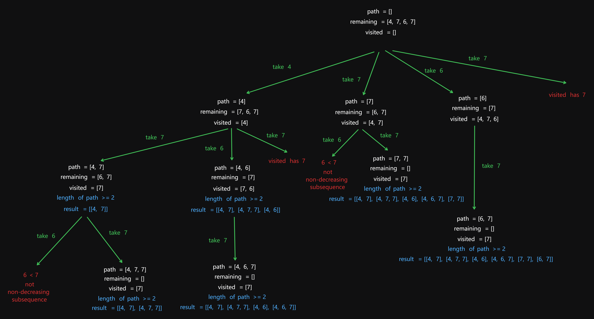

# 491 Non-decreasing Subsequences

Created: July 1, 2024 11:24 AM
Select: Medium
Topics: Array, Backtracking, Bit Manipulation, Hash Table

## 📖Description

[**Non-decreasing Subsequences**](https://leetcode.com/problems/non-decreasing-subsequences/description/)

## 🤔Intuition

The problem is to find all the different non-decreasing subsequences of the given array with at least two elements. To solve this, we can use a backtracking approach combined with a recursive function to explore all possible subsequences and check if all the elements of each substring are greater than their respective previous values.

## 📋Approach

### Recursion Tree



### **Recursive Backtracking**

**Implement a recursive function** `backtrack(path, startIndex)` **:**

- If the length of `path` is not less than two, the subsequences already meets the condition of containing at least two elements.
- An empty `Set<number>` called `visited` is used to keep track of elements used at the current level to avoid duplicates.
- Iterate through the remaining elements in `nums` starting from the given `startIndex` which is initialized to zero.
  - If the current element is already in `visited` , skip it (avoid duplicates at the same level).
  - If the `path` is empty or the current element is greater than the last element `path.at(-1)` , recursively call `backtrack` with itself and an updated `startIndex` , add it to the `visited` as well as append it to the `path` .

<aside>
💡 **There are two things to note here:**

1. No termination condition.
    
    Because all the subsequences are candidates.
    
2. There is no need to actively clean the `visited` .
    
    Because the `visited` is for avoiding duplicates at the same level, it will be redefined at the new level.
    
</aside>

## 📊Complexity

- **Time complexity:** $O(n * 2^n)$
- **Space complexity:** $O(n)$

## 🧑🏻‍💻Code

```tsx
function findSubsequences(nums: number[]): number[][] {
    const result: number[][] = [];

    const backtrack = (path: number[], startIndex: number): void => {
        if (path.length >= 2) {
            result.push([...path]);
        }

        const visited: Set<number> = new Set();

        for (let i = startIndex; i < nums.length; i++) {
            const num = nums[i];

            if (visited.has(num)) {
                continue;
            }

            if (path.length === 0 || num >= path.at(-1)!) {
                visited.add(num);
                path.push(num);
                backtrack(path, i + 1);
                path.pop();
            }
        }
    };

    backtrack([], 0);

    return result;
}
```

## 📋Optimized Approach

### **Recursive Backtracking**

We can use an `Array` instead of `Set` to avoid duplicates

## 📊Complexity

- **Time complexity:** $O(n * 2^n)$
- **Space complexity:** $O(n)$

## 🧑🏻‍💻Code

```tsx
function findSubsequences(nums: number[]): number[][] {
    const result: number[][] = [];

    const backtrack = (path: number[], startIndex: number): void => {
        if (path.length >= 2) {
            result.push([...path]);
        }

        const visited: number[] = new Array<number>(201).fill(0);

        for (let i = startIndex; i < nums.length; i++) {
            const num = nums[i];

            if (visited[num]) {
                continue;
            }

            if (path.length === 0 || num >= path.at(-1)!) {
                visited[num] = 1;
                path.push(num);
                backtrack(path, i + 1);
                path.pop();
            }
        }
    };

    backtrack([], 0);

    return result;
}
```
## 🔖Reference

1. [https://programmercarl.com/0491.递增子序列.html](https://programmercarl.com/0491.%E9%80%92%E5%A2%9E%E5%AD%90%E5%BA%8F%E5%88%97.html)
2. [https://leetcode.com/problems/non-decreasing-subsequences/solutions/3074832/javascript-explained-solution-beginner-friendly-backtracking-js/](https://leetcode.com/problems/non-decreasing-subsequences/solutions/3074832/javascript-explained-solution-beginner-friendly-backtracking-js/)