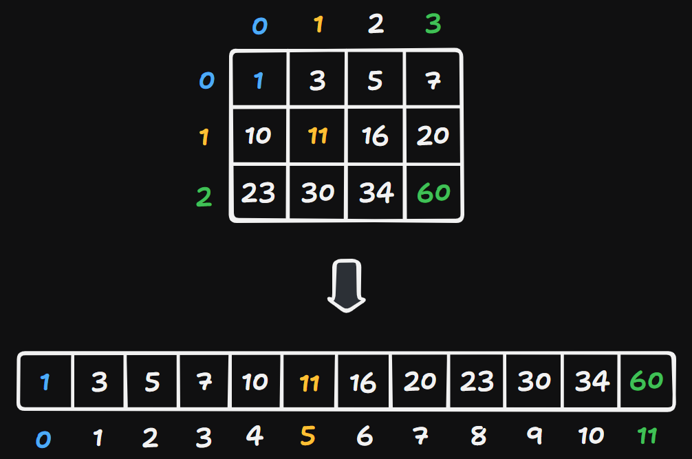

# 74 Search a 2D Matrix

Created: October 15, 2024 9:54 AM
Difficulty: Medium
Topics: Array, Binary-Search, Matrix
Status: Done

## 📖Description

[Search a 2D Matrix](https://leetcode.com/problems/search-a-2d-matrix/description)

## 🤔Intuition

This problem is about the application of **Binary Search Technology** in a 2D array. There are two intuitions for solve this problem:

1. Map the coordinates in the `matrix` to a 1D array to simulate the processing of **Binary Search** in the 1d array.
2. We first search for the row of the `target` by using **Binary Search Technology**, then we search the `target` in this row, which also depends **Binary Search Technology**. We will call this approach “Two Steps Method”.

## 📋Approach One

This approach is based on the Intuition One.

### Map The Coordinates



Because we want to treat the `matrix` as a 1D array, the position `i` in this 1D array can be accessed in the `matrix` by the following formulas:

```tsx
// i = 5
const n: number = matrix[0].length; // 4
const x: number = Math.floor(i / n); // 1
const y: number = i % n; // 1

// array[5] === matrix[1][1]
```

### **Binary Search Technology**

- Initialize two variables `left` and `right` to `0` and `m * n - 1` , separately.
- Start a `while` loop until the `left` greater than `right` ,
    - Calculate the index `mid` of middle element based on `left` and `right` .
    - Calculate the mapping of the index `mid` to the abscissa `x` in `matrix` .
    - Calculate the mapping of the index `mid` to the ordinate `y` in `matrix` .
    - Get the value of middle element from `matrix` by `matrix[x][y]` .
    - If the `midValue` is equal to `target` , it means the `target` has been found, then return `true` .
    - Else if the `midValue` is smaller than `target` , then the right side `[mid + 1, right]` is used for next search.
    - Otherwise, the left side `[left, mid - 1]` is used for the next search.
- If the `target` is not included in `matrix` , return `false` .

## 📊Complexity

- **Time Complexity:** $O(LogM+LogN)$
- **Space Complexity:** $O(M+N)$

## 🧑🏻‍💻Code

```tsx
function searchMatrix(matrix: number[][], target: number): boolean {
    const m: number = matrix.length;
    const n: number = matrix[0].length;
    let left: number = 0;
    let right: number = m * n - 1;

    while (left <= right) {
        const mid: number = left + ((right - left) >> 1);
        const x: number = Math.floor(mid / n);
        const y: number = mid % n;
        const midValue: number = matrix[x][y];

        if (midValue === target) {
            return true;
        } else if (midValue < target) {
            left = mid + 1;
        } else {
            right = mid - 1;
        }
    }

    return false;
}
```

## 📋Approach Two

This approach is based on the Intuition Two.

### **Binary Search Technology**

Implement a helper function `binarySearch(array)` :

- Initialize two variables `left` and `right` to `0` and `array.length-1` , separately.
- Start a `while` loop until the `left` greater than `right` ,
    - Calculate the index `mid` of middle element based on `left` and `right` .
    - Get the value of middle element from `matrix` by `array[mid]` .
    - If the `midValue` is equal to `target` , it means the `target` has been found, then return a record `{ found: true, index: mid }` .
    - Else if the `midValue` is smaller than `target` , then the right side `[mid + 1, right]` is used for next search.
    - Otherwise, the left side `[left, mid - 1]` is used for the next search.
- If the `target` is not included in the `array` , return `{ found: false, index: left - 1 }` , which `index` is the row of the subarray including `target` .

### Two Steps Binary Search

Based on the two properties mentioned in the description:
• Each row is sorted in non-decreasing order.
• The first integer of each row is greater than the last integer of the previous row.

We can use **Binary Search** to find the row where the `target` is located and search for the `target` in this row.

**Step One**

We first search for the row of the subarray including `target` .

```tsx
const { found, index } = binarySearch(matrix.map((row) => row[0]));

// Indicate that there is not subarray including target.
if (index < 0 || index >= matrix.length) {
    return false;
}
```

**Step Two**

If we has found the `target` in the array constructed from each first integer of each row, return `true` . Otherwise, use **Binary Search** to search the `target` from the subarray where the row is `index` , then return the `found` of the execution result.

```tsx
return found ? found : binarySearch(matrix[index]).found;
```

## 📊Complexity

- **Time Complexity:** $O(LogM+LogN)$
- **Space Complexity:** $O(M+N)$

## 🧑🏻‍💻Code

```tsx
function searchMatrix(matrix: number[][], target: number): boolean {
    const binarySearch = (
        array: number[]
    ): { found: boolean; index: number } => {
        let left: number = 0;
        let right: number = array.length - 1;

        while (left <= right) {
            const mid: number = left + ((right - left) >> 1);
            const midValue: number = array[mid];

            if (midValue === target) {
                return { found: true, index: mid };
            } else if (midValue < target) {
                left = mid + 1;
            } else {
                right = mid - 1;
            }
        }

        return { found: false, index: left - 1 };
    };

    const { found, index } = binarySearch(matrix.map((row) => row[0]));

    if (index < 0 || index >= matrix.length) {
        return false;
    }

    return found ? found : binarySearch(matrix[index]).found;
}
```

## 🔖Reference

None.