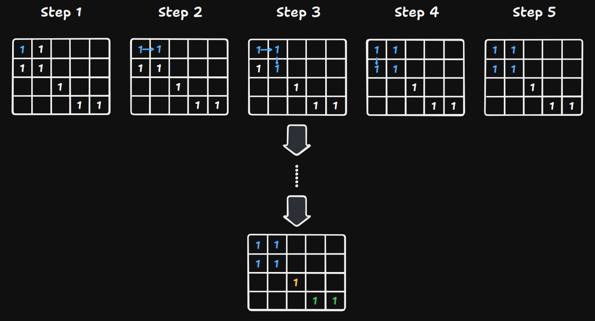
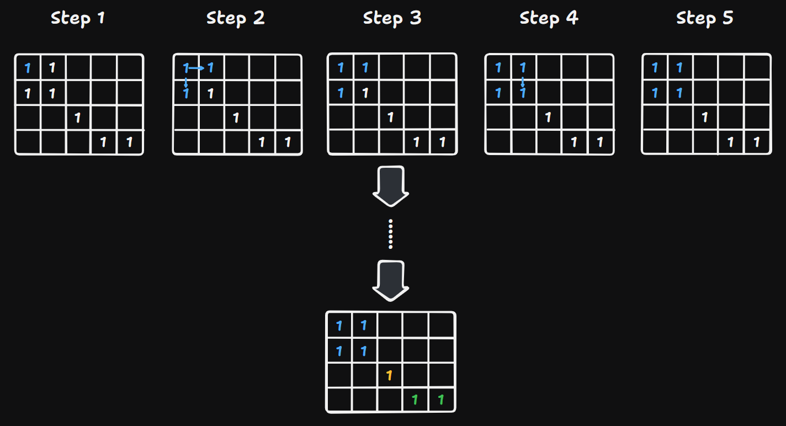

# 200 Number of Islands

Created: October 1, 2024 10:15 PM
Difficulty: Medium
Topics: Array, Breadth-First Search, Depth-First Search, Matrix
Status: Done

## 📖Description

[Number of Islands](https://leetcode.com/problems/number-of-islands/description/)

## 🤔Intuition

This question is about the typical application of **Depth-First Search (DFS)** and **Breadth-First Search (BFS)**. And the intuition to solve this problem is to traverse over all adjacent land cells of a land cell that has not been traversed before, then mark this traversed area as a island. After traversing the given `grid` , then count the number of all the islands which value is the answer.

This solution will use two fundamental graph traversal algorithms (**DFS** and **BFS)** separately to solve this problem.

## 📋Approach One

Approach One is based on **DFS.**

### Illustration



### Implementation of Helper Function `dfs(r, c)`

Implement a recursive function `dfs` to explore all adjacent land cell from the starting cell which coordinate is `(r, c)` .

- For each direction in `directions` ,
    - Calculate the adjacent cell coordinates `(x, y)` by `(r + directions[i], c + directions[i + 1])` .
    - If `(x, y)` is within the `grid` boundaries,
        - Check if this adjacent cell has been visited and it is a land cell, if these conditions are met, mark `visited[x][y]` to `true` , and call `dfs` recursively on that coordinate to explore further.

```tsx
const dfs = (r: number, c: number): void => {
    for (let i = 0; i < directions.length; ++i) {
        const x: number = r + directions[i];
        const y: number = c + directions[i + 1];

        if (x >= 0 && x < m && y >= 0 && y < n) {
            if (!visited[x][y] && grid[x][y] === '1') {
                visited[x][y] = true;

                dfs(x, y);
            }
        }
    }
};
```

### Step By Step Breakdown

- Initialize `m` and `n` to store the dimensions of the given `grid` .
- Create a 2d array `visited` initialized to `false` for keeping track of whether each cell has been visited.
- Define an array `directions` to represent the four direction of possible adjacent cell (up, right, down, left).
- Implement the helper function `dfs(r, c)` , which implementation has shown in the above part.
- Iterate over each cell in the `grid` by nested `reduce` .
    - If a cell is land cell and has not been visited,
    - Mark this cell is visited and increment the island count ( `acc` ).
    - Call `dfs(r, c)` to start the exploration of the entire island area from the beginning of this cell.
- Return the `result` from completion over the  `reduce` process.

## 📊Complexity

- **Time Complexity:** $O(M*N)$
- **Space Complexity:** $O(M*N)$

## 🧑🏻‍💻Code

```tsx
function numIslands(grid: string[][]): number {
    const m: number = grid.length;
    const n: number = grid[0].length;
    const visited: boolean[][] = Array.from({ length: m }, () =>
        Array(n).fill(false)
    );
    const directions: number[] = [-1, 0, 1, 0, -1];
    const dfs = (r: number, c: number): void => {
        for (let i = 0; i < directions.length; ++i) {
            const x: number = r + directions[i];
            const y: number = c + directions[i + 1];

            if (x >= 0 && x < m && y >= 0 && y < n) {
                if (!visited[x][y] && grid[x][y] === '1') {
                    visited[x][y] = true;

                    dfs(x, y);
                }
            }
        }
    };

    return grid.reduce((result, rows, r) => {
        result = rows.reduce((acc, el, c) => {
            if (!visited[r][c] && el === '1') {
                visited[r][c] = true;

                ++acc;

                dfs(r, c);
            }

            return acc;
        }, result);

        return result;
    }, 0);
}
```

## 📋Approach Two

Approach One is based on B**FS.**

### Illustration



### Implementation of Helper Function `bfs(r, c)`

Implement a helper function `bfs` to explore all adjacent land cell from the starting cell which coordinate is `(r, c)` .

- Create a `queue` initialized to starting cell `(r, c)` . (The `visited[r][c]` has already set to `true` before `bfs(r, c)` is called)
- Keep running a `while` loop while there are cells in the `queue` .
    - Dequeue the current cell which coordinate is `(currX, currY)` .
    - For each direction in `directions` ,
        - Calculate the adjacent cell coordinates `(x, y)` by `(currX + directions[i], currY + directions[i + 1])` .
        - If `(x, y)` is within the `grid` boundaries,
            - Check if this adjacent cell has been visited and it is a land cell, if these conditions are met, mark `visited[x][y]` to `true` , and enqueue this cell to explore further.

```tsx
const bfs = (r: number, c: number): void => {
    const queue: [number, number][] = [[r, c]];

    while (queue.length > 0) {
        const [currX, currY]: [number, number] = queue.shift()!;

        for (let i = 0; i < directions.length; ++i) {
            const x: number = currX + directions[i];
            const y: number = currY + directions[i + 1];

            if (x >= 0 && x < m && y >= 0 && y < n) {
                if (!visited[x][y] && grid[x][y] === '1') {
                    queue.push([x, y]);

                    visited[x][y] = true;
                }
            }
        }
    }
};
```

### Step By Step Breakdown

- Initialize `m` and `n` to store the dimensions of the given `grid` .
- Create a 2d array `visited` initialized to `false` for keeping track of whether each cell has been visited.
- Define an array `directions` to represent the four direction of possible adjacent cell (up, right, down, left).
- Implement the helper function `bfs(r, c)` , which implementation has shown in the above part.
- Iterate over each cell in the `grid` by nested `reduce` .
    - If a cell is land cell and has not been visited,
    - Mark this cell is visited and increment the island count ( `acc` ).
    - Call `dfs(r, c)` to start the exploration of the entire island area from the beginning of this cell.
- Return the `result` from completion over the  `reduce` process.

## 📊Complexity

- **Time Complexity:** $O(M*N)$
- **Space Complexity:** $O(M*N)$

## 🧑🏻‍💻Code

```tsx

function numIslands(grid: string[][]): number {
    const m: number = grid.length;
    const n: number = grid[0].length;
    const visited: boolean[][] = Array.from({ length: m }, () =>
        new Array(n).fill(false)
    );
    const directions: number[] = [-1, 0, 1, 0, -1];
    const bfs = (r: number, c: number): void => {
        const queue: [number, number][] = [[r, c]];

        while (queue.length > 0) {
            const [currX, currY]: [number, number] = queue.shift()!;

            for (let i = 0; i < directions.length; ++i) {
                const x: number = currX + directions[i];
                const y: number = currY + directions[i + 1];

                if (x >= 0 && x < m && y >= 0 && y < n) {
                    if (!visited[x][y] && grid[x][y] === '1') {
                        queue.push([x, y]);

                        visited[x][y] = true;
                    }
                }
            }
        }
    };

    return grid.reduce((result, rows, r) => {
        result = rows.reduce((acc, el, c) => {
            if (!visited[r][c] && el === '1') {
                visited[r][c] = true;

                ++acc;

                bfs(r, c);
            }

            return acc;
        }, result);

        return result;
    }, 0);
}
```

## 🔖Reference

1. [https://programmercarl.com/kamacoder/0099.岛屿的数量深搜.html](https://programmercarl.com/kamacoder/0099.%E5%B2%9B%E5%B1%BF%E7%9A%84%E6%95%B0%E9%87%8F%E6%B7%B1%E6%90%9C.html)
2. [https://programmercarl.com/kamacoder/0099.岛屿的数量广搜.html](https://programmercarl.com/kamacoder/0099.%E5%B2%9B%E5%B1%BF%E7%9A%84%E6%95%B0%E9%87%8F%E5%B9%BF%E6%90%9C.html)
3. [https://www.geeksforgeeks.org/breadth-first-search-or-bfs-for-a-graph/](https://www.geeksforgeeks.org/breadth-first-search-or-bfs-for-a-graph/)
4. [https://www.geeksforgeeks.org/depth-first-search-or-dfs-for-a-graph/](https://www.geeksforgeeks.org/depth-first-search-or-dfs-for-a-graph/)