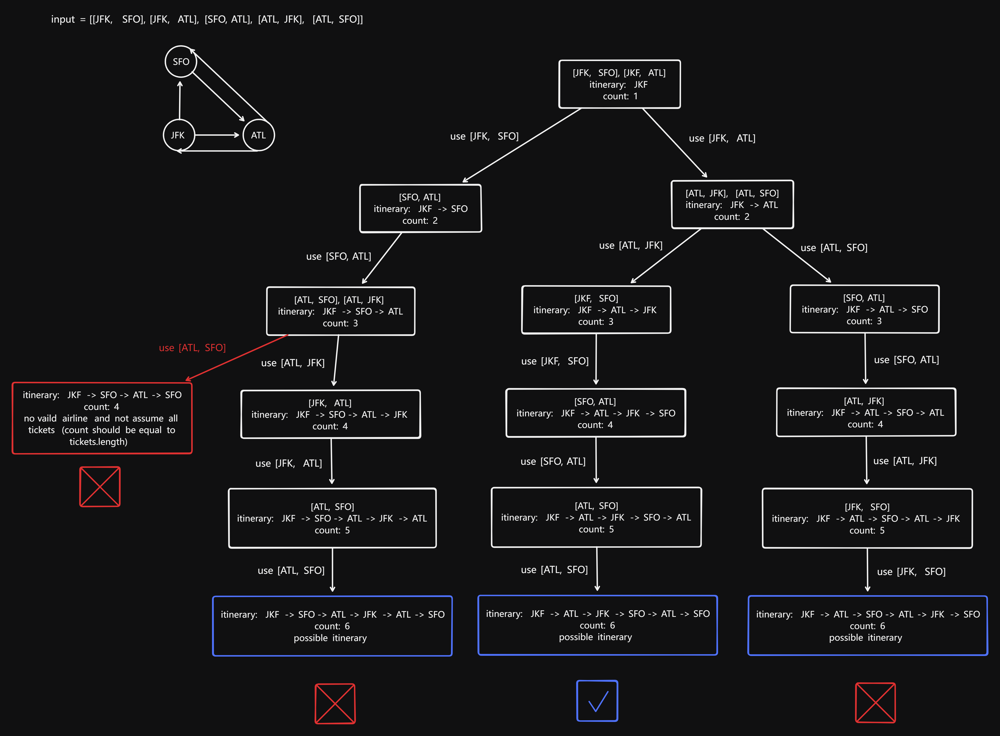

# 332 Reconstruct Itinerary

Created: July 8, 2024 9:23 AM
Select: Hard
Topics: Depth-First Search, Eulerian Circuit, Graph

## 📖Description

[**Reconstruct Itinerary**](https://leetcode.com/problems/reconstruct-itinerary/)

## 🤔Intuition

The problem can be interpreted as meaning that we are going to use up all the tickets which can be use only once, depart from “JKF”, and visit all airports. We can use Depth-First Search (DFS) method to solve this problem.

## 📋Approach

### **State-space Tree**



### Sort By Lexical Order

Among multiple valid itineraries, the one with the smallest lexical order is necessary.

```tsx
tickets.sort((a, b) => a[1].localeCompare(b[1]));
```

### Initialize the Graph

We are going to create an adjacency list graph that representation of the flights. In order to avoid endless loop in recursive backtracking, consider the case `tickets = [["JFK", "SFO"], ["SFO", "JFK"]]` , thus, we need to add an additional flag for the count of this flight in the adjacency list. If the `count` is equal to 0, means this arrival airport can not be chosen again.

```tsx
type TicketsMap = {
        [index: string]: Map<string, number>;
    };
const ticketsMap: TicketsMap = {};

for (const [from, to] of tickets) {
    if (!ticketsMap[from]) {
        ticketsMap[from] = new Map();
    }
    ticketsMap[from].set(to, (ticketsMap[from].get(to) ?? 0) + 1);
}
```

### **Recursive Backtracking**

**Implement a recursive function** `backtrack(path)` **:**

- If the length of `path` is equal to length of `tickets + 1` , means there is no more destinations to visit, return `true` .
- Get destinations `to` and `count` by iterating over the current airport’s `targetsMap` .
  - If `count > 0` , means this destination `to` is allow to be chosen as the next airport, thus, append it to the `path` , and use `count - 1` to update the value of current `to` ’s `targetsMap` .
  - Recursively call `backtrack` with `path` , if the return value is `true` , finish backtracking process.

## 📊Complexity

- **Time complexity:** $O(NlogN)$
- **Space complexity:** $O(N)$

## 🧑🏻‍💻Code

```tsx
function findItinerary(tickets: string[][]): string[] {
    type TicketsMap = {
        [index: string]: Map<string, number>;
    };
    const ticketsMap: TicketsMap = {};

    tickets.sort((a, b) => (a[1] < b[1] ? -1 : 1));
    for (const [from, to] of tickets) {
        if (!ticketsMap[from]) {
            ticketsMap[from] = new Map();
        }
        ticketsMap[from].set(to, (ticketsMap[from].get(to) ?? 0) + 1);
    }

    const result: string[] = ['JFK'];
    const ticketsNum: number = tickets.length;

    const backtrack = (path: string[]): boolean => {
        if (path.length === ticketsNum + 1) {
            return true;
        }

        const targetsMap = ticketsMap[path.at(-1) ?? ''];
        if (targetsMap) {
            for (const [to, count] of targetsMap.entries()) {
                if (count > 0) {
                    path.push(to);
                    targetsMap.set(to, count - 1);
                    if (backtrack(path)) {
                        return true;
                    }
                    targetsMap.set(to, count);
                    path.pop();
                }
            }
        }

        return false;
    };

    backtrack(result);

    return result;
}
```

## 📋Optimized Approach

The above approach is actually more in line with the solution of backtracking problems. In fact, the goal of solving this problem can be regard as finding an Eulerian path or circuit that sticks to smallest lexical order in an Eulerian graph or semi-Eulerian graph composed of flights. There is a efficient way ($O(E)$, i.e., linear time) to find the path/circuit —— Hierholzer’s Algorithm.

### Hierholzer’s Algorithm

- Choose an suitable starting vertex, e.g., `"JFK"` in this problem.
- Keep following unused edges and removing them until we get stuck.
- Once we get stuck, append the current vertex to `result` , and backtrack to the nearest vertex in our current itinerary that has unused edges.
- Repeat this process until all the edges have been used.

## 📊Complexity

- **Time complexity:** $O(NlogN)$
- **Space complexity:** $O(N)$

## 🧑🏻‍💻Code

```tsx
function findItinerary(tickets: string[][]): string[] {
    type TicketsMap = {
        [index: string]: string[];
    };
    const ticketsMap: TicketsMap = {};

    for (const [from, to] of tickets) {
        ticketsMap[from] = ticketsMap[from] ?? [];
        ticketsMap[from].push(to);
    }

    for (const [from] of tickets) {
        ticketsMap[from].sort();
    }

    const result: string[] = [];

    const dfs = (airport: string): void => {
        const destinations: string[] = ticketsMap[airport] ?? [];
        while (destinations.length > 0) {
            dfs(destinations.shift()!);
        }

        result.push(airport);
    };

    dfs('JFK');

    return result.reverse();
}
```

## 🔖Reference

1. [https://programmercarl.com/0332.重新安排行程.html#算法公开课](https://programmercarl.com/0332.%E9%87%8D%E6%96%B0%E5%AE%89%E6%8E%92%E8%A1%8C%E7%A8%8B.html#%E7%AE%97%E6%B3%95%E5%85%AC%E5%BC%80%E8%AF%BE)
2. [https://www.geeksforgeeks.org/hierholzers-algorithm-directed-graph/](https://www.geeksforgeeks.org/hierholzers-algorithm-directed-graph/)
3. [https://leetcode.cn/circle/discuss/Dh85Wa/](https://leetcode.cn/circle/discuss/Dh85Wa/)
4. [https://leetcode.com/problems/reconstruct-itinerary/solutions/4041944/95-76-dfs-recursive-iterative/](https://leetcode.com/problems/reconstruct-itinerary/solutions/4041944/95-76-dfs-recursive-iterative/)
5. [https://leetcode.com/problems/reconstruct-itinerary/solutions/4042491/video-visualized-solution-python-javascript-java-c/](https://leetcode.com/problems/reconstruct-itinerary/solutions/4042491/video-visualized-solution-python-javascript-java-c/)
