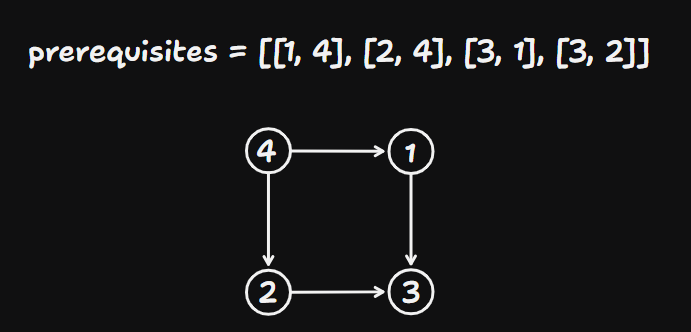
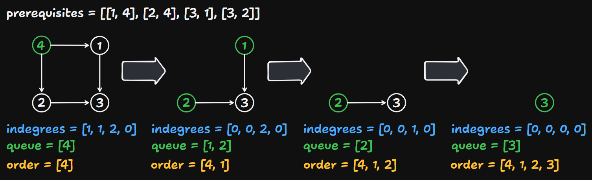

# 210 Course Schedule II

Created: October 11, 2024 11:22 AM
Difficulty: Medium
Topics: Breadth-First Search, Depth-First Search, Graph, Topological Sort
Status: Done

## 📖Description

[Course Schedule II](https://leetcode.com/problems/course-schedule-ii/description)

## 🤔Intuition

This problem can be visualized as a directed graph where courses are nodes and prerequisites are the directed edges. And the purpose of this problem is to find out the [**Topological Ordering](https://en.wikipedia.org/wiki/Topological_ordering)** of the directed graph formed by `prerequisites` .

There are two methods to determine the Topological Ordering:

- **DFS Approach.**
- **BFS Approach (Kahn’s Algorithm).**

Here will use these two methods separately to solve this problem.

## 📋Approach One

This approach utilizes **DFS** to traverse the graph.

### Graph Representation (Adjacency List)

Each course can depend on one or more other courses, so we can build a direction graph formed by these relationships. If a course `a` must be taken before course `b` , we draw a directed edge from `a` to `b` .

Take `prerequisites = [[1, 4], [2, 4], [3, 1], [3, 2]]` as an example:

**Illustration**



**Code Implementation**

```tsx
const graph: number[][] = Array.from({ length: numCourses }, () => []);

prerequisites.forEach(([course, preCourse]) => {
		graph[preCourse].push(course);
})
```

### Cycle Detection

For cycle detection in directed graph, we need to track the visitation state of each node using three states:

1. **Not Visited**: Indicate that the node hasn’t been explored yet.
2. **Visiting**: Indicate that the node is currently in the **DFS** process, if we encounter this status again during the current **DFS** process, it means there is a cycle in the directed graph.
3. **Visited**: Indicate that the **DFS** process has been completed, and no cycles were found.

We can maintain an array `visited` ,which length is equal to `numCourses` and initialized to `0` for tracking visited courses.

```tsx
// 0: not visited 1: visiting 2: visited
const visited: number[] = new Array(numCourses).fill(0); 
```

### Define Function `dfs(course)`

The aim of `dfs(course)` is to explore the graph to detect cycles and record the Topological Ordering using **Depth-First Search**.

- If the `course` is already in the visiting state ( `visited[course] === 1` ), it means that we found a cycle in this directed graph, then we set `hasCycle` to `true` and return;
- If the `course` is already fully explored ( `visited[course] === 2` ) or there a cycle in the graph ( `hasCycle` is `true` ), stop the current recursive process.
- Update the state of current `course` to visiting state ( `visited[course] === 1` ).
- Explore all neighbors of current `course` recursively.
- Update the state of current `course` to visited state ( `visited[course] === 2` ).
- Push the current `course` to the `result` .

### Step By Step Breakdown

- Define an empty array `result` to store the answer of the problem.
- Initialize directed graph as an adjacency list `graph` .
- Maintain an array `visited` ,which length is equal to `numCourses` and initialized to `0` for tracking visited courses.
- Use a variable `hasCycle` to mark if there is a cycle in `graph` .
- Represent the `graph` , which details has been shown in the Graph Representation (Adjacency List) part.
- Implement the function `dfs(course)` to explore the `graph` to detect cycles and record the topological ordering, which details of implementation has been shown in the Define Function `dfs(course)` part.
- Start a `for` loop to execute all the courses.
- If `hasCycle` is `true` , indicates that there has a cycle in the `graph` , so return an empty array `[]` as result. Otherwise, return the reverse of `result` (This is because the start node is the last one to be added to the `result` ).

## 📊Complexity

- **Time Complexity:** $O(V+E)$
- **Space Complexity:** $O(V+E)$

## 🧑🏻‍💻Code

```tsx
function findOrder(numCourses: number, prerequisites: number[][]): number[] {
    const result: number[] = [];
    const graph: number[][] = Array.from({ length: numCourses }, () => []);
    const visited: number[] = new Array(numCourses).fill(0);
    let hasCycle: boolean = false;

    prerequisites.forEach(([course, preCourse]) => {
        graph[preCourse].push(course);
    });

    const dfs = (course: number): void => {
        if (visited[course] === 1) {
            hasCycle = true;

            return;
        }
        if (hasCycle || visited[course] === 2) {
            return;
        }

        visited[course] = 1;

        graph[course].forEach((neighbor) => dfs(neighbor));

        visited[course] = 2;
        result.push(course);
    };

    for (let i = 0; i < numCourses; ++i) {
        if (visited[i] === 0) {
            dfs(i);
        }
    }

    return hasCycle ? [] : result.reverse();
}
```

## 📋Approach Two

This approach utilizes **BFS (Kahn’s Algorithm)** to traverse the graph.

### Graph Representation And In-degree Initialization

This approach uses the same way as Approach One to build the directed graph, but we also need to record the in-degree of each node during the graph representation process.

```tsx
const graph: number[][] = Array.from({ length: numCourses }, () => []);
const indegrees: number = new Array(numCourses).fill(0);

prerequisites.forEach(([course, preCourse]) => {
		graph[preCourse].push(course);
		++indegrees[course];
})
```

### Initialize `queue`

The `queue` is used to process courses in **BFS** manner.

```tsx
const queue: number[] = [];

indegrees.forEach((indegree, index) => {
    if (indegree === 0) {
        queue.push(index);
    }
})
```

### Illustration



### Step By Step Breakdown

- Define an empty array `result` to store the answer of the problem.
- Initialize directed graph as an adjacency list `graph` .
- Initialize an array `indegrees` with `0` , which length is equal to `numCourses` .
- Construct the `graph` and calculate the `indegrees` .
- Create the `queue` with courses that have no `prerequisites` .
- Start a `while` loop for the BFS processing,
    - Remove a course from the `queue` and use a variable `currCourse` to store it.
    - Add `currCourse` to the `result` .
    - Iterate through all the neighbors of `currCourse` ,
        - If the in-degree of current neighbor `indegrees[neighbor]` after decrementing is equal to `0` , it means that there are no prerequisites of this current neighbor.
            - Push this neighbor to the `queue` .
- Check if the length of `result` is equal to `numCourses` , if yes, return the `result` . Otherwise, it indicates a cycle in the `graph` , then return a empty array `[]` .

## 📊Complexity

- **Time Complexity:** $O(V+E)$
- **Space Complexity:** $O(V+E)$

## 🧑🏻‍💻Code

```tsx
function findOrder(numCourses: number, prerequisites: number[][]): number[] {
    const result: number[] = [];
    const graph: number[][] = Array.from({ length: numCourses }, () => []);
    const indegrees: number[] = new Array(numCourses).fill(0);
    
    prerequisites.forEach(([course, preCourse]) => {
        graph[preCourse].push(course);
        ++indegrees[course];
    });
    
    const queue: number[] = [];
    
    indegrees.forEach((count, index) => {
        if (count === 0) {
            queue.push(index);
        }
    })
    
    while (queue.length > 0) {
        const currCourse: number = queue.shift()!;
        
        result.push(currCourse);
        
        graph[currCourse].forEach((neighbour) => {
            if (--indegrees[neighbour] === 0) {
                queue.push(neighbour);
            }
        })
    }
    
    return result.length === numCourses ? result : [];
}
```

## 🔖Reference

1. [https://algo.itcharge.cn/08.Graph/02.Graph-Traversal/05.Graph-Topological-Sorting/](https://algo.itcharge.cn/08.Graph/02.Graph-Traversal/05.Graph-Topological-Sorting/)
2. [https://linlexiao.com/2023/03/23/拓扑排序/index.html](https://linlexiao.com/2023/03/23/%E6%8B%93%E6%89%91%E6%8E%92%E5%BA%8F/index.html)