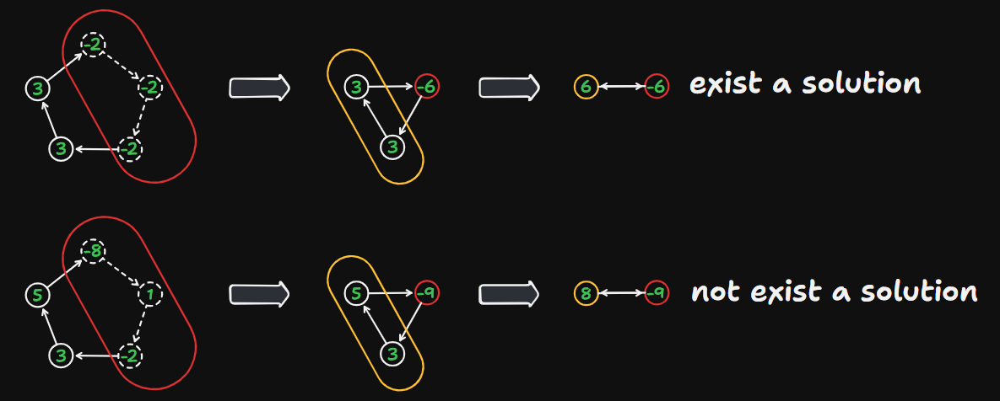
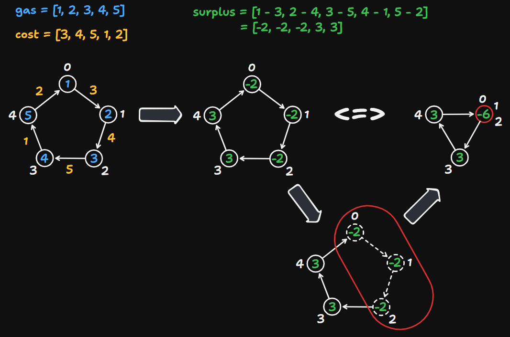

# 134 Gas Station

Created: August 30, 2024 7:55 PM
Difficulty: Medium
Topics: Array

## 📖Description

[Gas Station](https://leetcode.com/problems/gas-station/description)

## 🤔Intuition

To solve this problem, a simple method to come up with is to try starting from each gas station, and valid if the car can travel around the circuit once in the clockwise direction. But this is a brute force solution with $O(n^2)$ time complexity, and LeetCode will consider it to be beyond the time limit. So, we will not present the code of this approach, but focus on discussing optimization approach.

## 📋Optimized Approach

We use an array `surplus` to represent array `gas` minus array `cost` for the convenience of finding the valid starting gas station. And based on the description of this problem, we can draw a conclusion that:

- If `gas[i] - cost[i]` is less than 0, means the gas station `*i*` can not be the starting point.
- Start from any gas station `i` , if the cumulative surplus ( `surplus[i] + surplus[i + 1] + ... + surplus[n]` ) is less than 0, this starting point is invalid.

If there are intervals in the array with negative cumulative values in `surplus` , we can use this cumulative value to represent this interval. Similarly, non negative cumulative values intervals also have the same properties. 

So, if we merge all negative and non negative cumulative value intervals separately, then we will get another conclusion that if the sum of the values of all element in `surplus` is less than 0, indicates there is not exist a solution. Otherwise, there must be a solution.



### Illustration



Step By Step Breakdown:

- Initialize three variables `startIndex` , `totalSurplus` and `currentSurplus` to represent starting pointer, total sum of gas surplus and current accumulation of gas surplus, respectively.
- Iterate over all the gas stations.
    - Calculate the current gas station index `i` surplus `surplus` by `gas[i] - cost[i]` .
    - Update the `totalSurplus` to `totalSurPlus + surplus` .
    - Update the `currentSurplus` to `currentSurplus + surplus` .
    - If `currentSurplus` is less than 0, means we need to try to take another gas station as starting point.
        - Update the `startIndex` to `i + 1` , because as mentioned earlier, we can skip enter negative interval and set the next index of the negative interval as the new starting point.
        - Reset the `currentSurplus` to 0.
- If `totalSurplus` is not less than 0, means there is exist a solution, return `startIndex` . Otherwise, return -1.

## 📊Complexity

- **Time complexity:**  $O(N)$
- **Space complexity:**  $O(1)$

## 🧑🏻‍💻Code

```tsx
function canCompleteCircuit(gas: number[], cost: number[]): number {
    const len: number = gas.length;

    let startIndex: number = 0;
    let totalSurplus: number = 0;

    for (let i = 0, currentSurplus = 0; i < len; ++i) {
        const surplus: number = gas[i] - cost[i];

        totalSurplus += surplus;
        currentSurplus += surplus;

        if (currentSurplus < 0) {
            startIndex = i + 1;
            currentSurplus = 0;
        }
    }

    return totalSurplus >= 0 ? startIndex : -1;
```

## 🔖Reference

1. [https://programmercarl.com/0134.加油站.html](https://programmercarl.com/0134.%E5%8A%A0%E6%B2%B9%E7%AB%99.html)
2. [https://leetcode.com/problems/gas-station/solutions/4538939/easy-efficient-solution-c-greedy/?envType=study-plan-v2&envId=top-interview-150](https://leetcode.com/problems/gas-station/solutions/4538939/easy-efficient-solution-c-greedy/?envType=study-plan-v2&envId=top-interview-150)
3. [https://leetcode.com/problems/gas-station/solutions/4864338/beats-98-34-greedy-approach-for-gas-station-typescript-javascript-greedy/?envType=study-plan-v2&envId=top-interview-150](https://leetcode.com/problems/gas-station/solutions/4864338/beats-98-34-greedy-approach-for-gas-station-typescript-javascript-greedy/?envType=study-plan-v2&envId=top-interview-150)