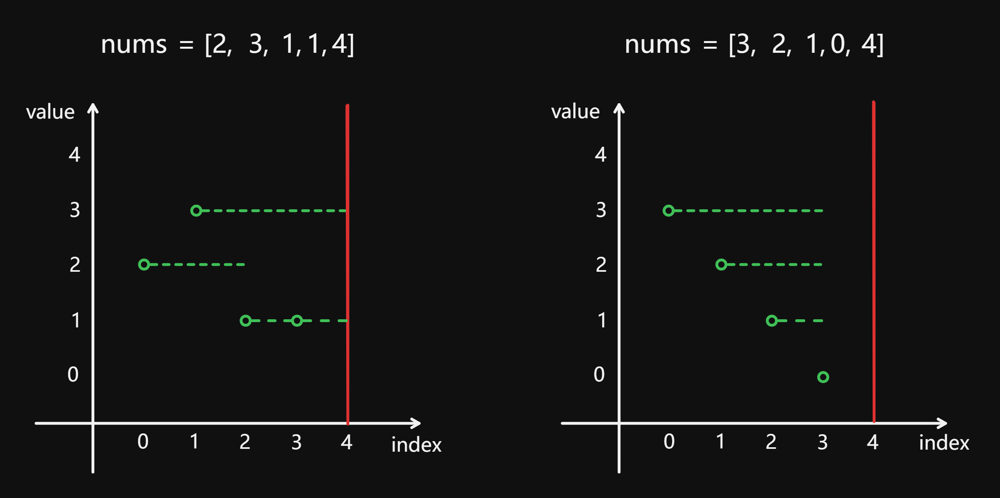

# 55 Jump Game

Created: August 27, 2024 5:01 PM
Difficulty: Medium
Topics: Array, Dynamic Programming, Greedy

## 📖Description

[Jump Game](https://leetcode.com/problems/jump-game/description/)

## 🤔Intuition

Imagine, we are about to go from Terminal 0 to Terminal 4 (take `nums = [2, 3, 1, 1, 4]` as an example, and the number of terminal correspond to the indices of the `nums` ) at an airport with terminals arranged in series. 

Each Terminal has an moving walkway, and the `nums[n]` represents the number of the farthest terminal that can be reached by the walkway starting from Terminal `n` .

Now, we are taking on a challenge to successfully reach Terminal 4 by only taking the moving walkway.

If there is a path that meets the conditions, the optimal strategy to complete this challenge is to transfer to the moving walkway which farthest terminal can be reached is further than current one, as long as passing through a terminal.

## 📋Approach One

The optimal strategy proposed in Intuition is essentially the idea of the greedy algorithm.

### Illustration



The dashed line in the figure represents the coverage range of the moving walkway, and the red line represents the destination Terminal 4.

Start from index 0, when we get to the Terminal 1, check if the moving walkway here can reach is further than current one. If so, transfer, otherwise, do nothing.

### **Step By Step Breakdown**

- Initialize a variable `maxReach` to 0 for recording maximum reachable distance of current index.
- Iterate through the given array `nums` .
    - If `i` greater than `maxReasch` , indicates the index cannot be reached, then returns `false` .
    - Update the `maxReach` to the largest one between `maxReach` and `i + nums[i]` .
    - If `maxReach` is not less than `len - 1` , means there is a valid way to reach the last index, returns `true` .
- Return `false` .

## 📊Complexity

- **Time complexity:** $O(N)$
- **Space complexity:** $O(1)$

## 🧑🏻‍💻Code

```tsx
function canJump(nums: number[]): boolean {
    const len: number = nums.length;

    if (len === 1) {
        return true;
    }

    let maxReach: number = 0;

    for (let i = 0; i < len - 1; ++i) {
        if (i > maxReach) {
            return false;
        }

        maxReach = Math.max(maxReach, i + nums[i]);

        if (maxReach >= len - 1) {
            return true;
        }
    }

    return false;
}
```

## 📋Approach Two

Approach Two is a genius method I saw in the LeetCode Solutions:

[Super simple, intuitive, 8-line Python solution (beats 99.92% of users)!](https://leetcode.com/problems/jump-game/solutions/4534808/super-simple-intuitive-8-line-python-solution-beats-99-92-of-users)

## 📊Complexity

- **Time complexity:** $O(N)$
- **Space complexity:** $O(1)$

## 🧑🏻‍💻Code

```tsx
function canJump(nums: number[]): boolean {
    let gas: number = 0;

    for (const num of nums) {
        if (gas < 0) {
            return false;
        } else if (num > gas) {
            gas = num;
        }

        --gas;
    }

    return true;
}
```

## 🔖Reference

1. [https://leetcode.com/problems/jump-game/solutions/4534808/super-simple-intuitive-8-line-python-solution-beats-99-92-of-users](https://leetcode.com/problems/jump-game/solutions/4534808/super-simple-intuitive-8-line-python-solution-beats-99-92-of-users)
2. [https://programmercarl.com/0055.跳跃游戏.html](https://programmercarl.com/0055.%E8%B7%B3%E8%B7%83%E6%B8%B8%E6%88%8F.html)