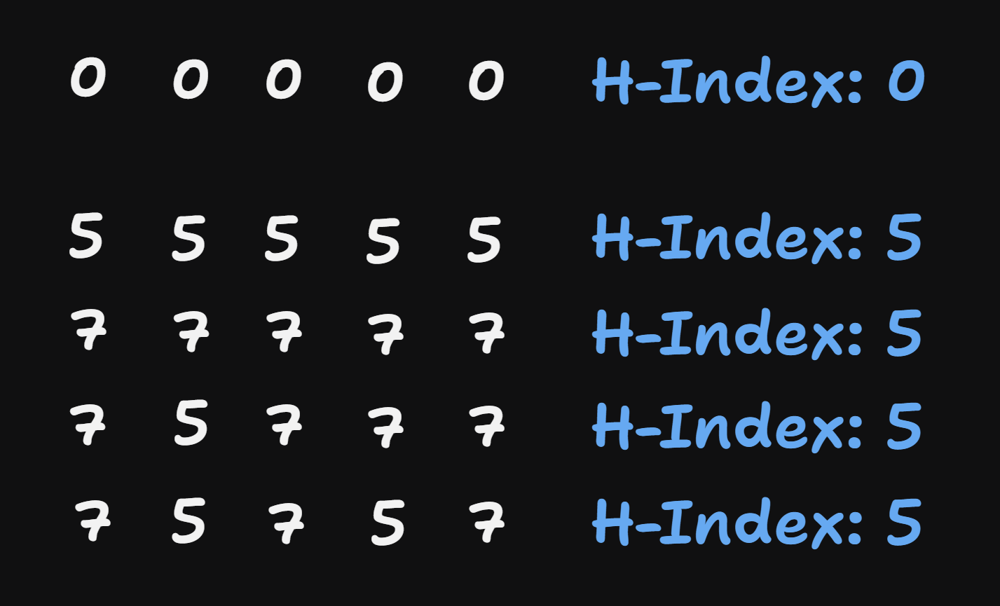
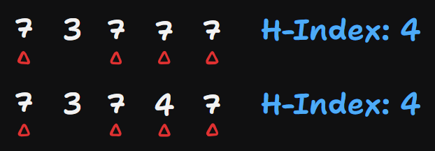
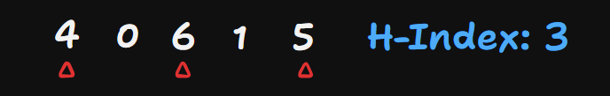
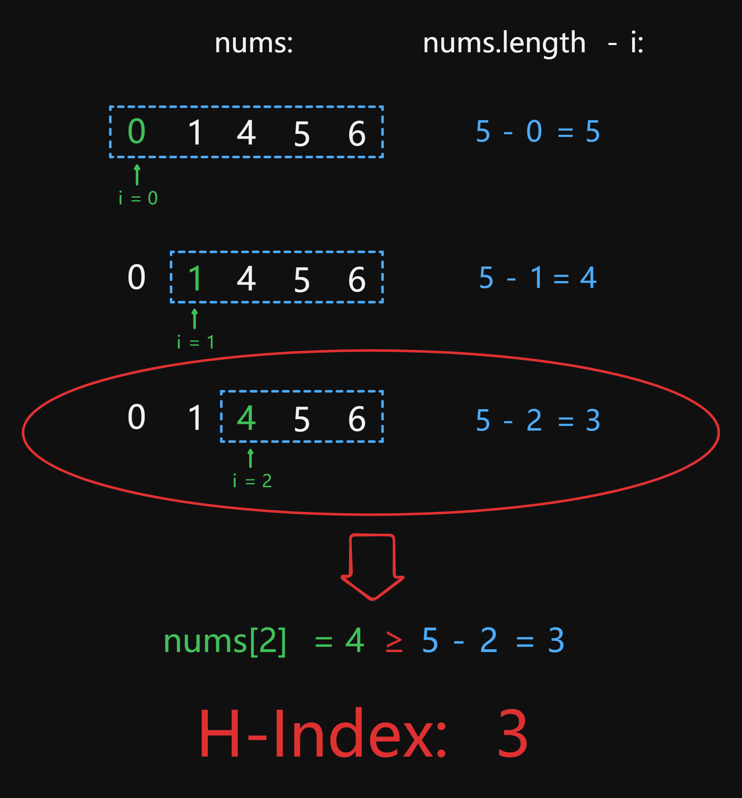
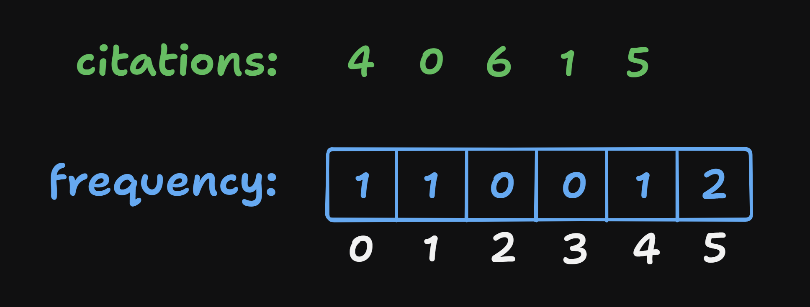

# 274 H-Index

Created: August 28, 2024 7:52 PM
Difficulty: Medium
Topics: Array

## 📖Description

[H-Index](https://leetcode.com/problems/h-index/description)

## 🤔Intuition

One of the difficulties in this question is understanding the definition of H-Index. In other words, we need to find out a maximum number `h` that satisfies the condition that there are directly `h` elements in the given array `citations` whose values are not less than `h` .

So, we may be confused by the intuition that the answer `hIndex` comes from one of the elements in the array. But the `hIndex` should be the number of elements in the array that satisfy the condition.

## 📋Approach One

For a number array with a length of 5, regardless of the values of its elements, the maximum H-Index of this array can only be 5, which is the length of itself, and the minimum H-Index can only be 0 (while the array is `[0, 0, 0, 0, 0]`).



So, under what circumstances does the array of length 5 have a H-Index of 4? We just need to reduce one of elements’ value to less than 4 and keep the values of the other four elements greater than or equal to 4.



What about H-Index is 3? Similarly, We only need to reduce two of elements’ value to less than 3 and keep the values of the other three elements not less than 3.



Now, I think you already have a clear understanding of the definition of the H-Index. Next, we will figure out how to determine the value of H-Index.

Taking `nums = [4, 0, 6, 1, 5]` as an example, we sort the `nums` first, then we get `nums = [0, 1, 4, 5, 6]` . According to the particularity of non-decreasing array, all the value of elements will not less than the length only if the non-decreasing array’s first element value is not less than its length. The same principle applies to its sub-array `[nums[i], ..., nums[nums.length - 1]]` which `nums[i]` is not less than `nums.length - 1` . Ultimately, we see the length of this sub-array is the H-Index of `nums` .

### Illustration



### Approach Steps

- Sort the array `citations` as a non-decreasing array.
- Iterate through the array `citations` .
    - If the value of current element `citations[i]` is not less than the length of sub-array which first element is `citations[i]` , calculated from `citations.length - i` , then return the value of `citations.length - i` .
- Return 0;

## 📊Complexity

- **Time complexity:** $O(NlogN)$
- **Space complexity:** $O(1)$

## 🧑🏻‍💻Code

```tsx
function hIndex(citations: number[]): number {
    const len: number = citations.length;

    citations.sort((a, b) => a - b);

    for (let i = 0; i < len; ++i) {
        if (citations[i] >= len - i) {
            return len - i;
        }
    }

    return 0;
}
```

## 📋Approach Two

A faster approach is to use  Counting Sort, but this need require extra space.



Step By Step breakdown:

- Create an array `frequency` to record frequency of elements occurrence.
    - If `citations[i]` is less than `citations.length` , then set `frequency[citations[i]]` to `frequency[citations[i]] + 1` .
    - Else, set `frequency[citations.length]` to `frequency[citations.length] + 1` .
- Start a `for` loop beginning from index `citations.length` till `i` (actually, `i` is H-Index) is not less than 0 or `count` is not less than `i` .
    - Update `count` to `count + frequecncy[i]` .
    - If `count` is not less than `i` , means the maximum H-Index is found, return `i` .
- Return 0.

## 📊Complexity

- **Time complexity:** $O(N)$
- **Space complexity:** $O(N)$

## 🧑🏻‍💻Code

```tsx
function hIndex(citations: number[]): number {
    const len: number = citations.length;
    const frequency: number[] = citations.reduce(
        (acc, cur) => (cur < len ? (++acc[cur], acc) : (++acc[len], acc)),
        new Array(len + 1).fill(0)
    );

    for (let i = len, count = 0; i >= 0; --i) {
        count += frequency[i];

        if (count >= i) {
            return i;
        }
    }

    return 0;
}
```

## 🔖Reference

1. [https://leetcode.com/problems/h-index/solutions/5561432/easiest-solution-with-explanation-beats-100](https://leetcode.com/problems/h-index/solutions/5561432/easiest-solution-with-explanation-beats-100)
2. [https://medium.com/@ralph-tech/演算法學習筆記-計數排序-counting-sort-基數排序-radix-sort-5b0c8e596f81](https://medium.com/@ralph-tech/%E6%BC%94%E7%AE%97%E6%B3%95%E5%AD%B8%E7%BF%92%E7%AD%86%E8%A8%98-%E8%A8%88%E6%95%B8%E6%8E%92%E5%BA%8F-counting-sort-%E5%9F%BA%E6%95%B8%E6%8E%92%E5%BA%8F-radix-sort-5b0c8e596f81)