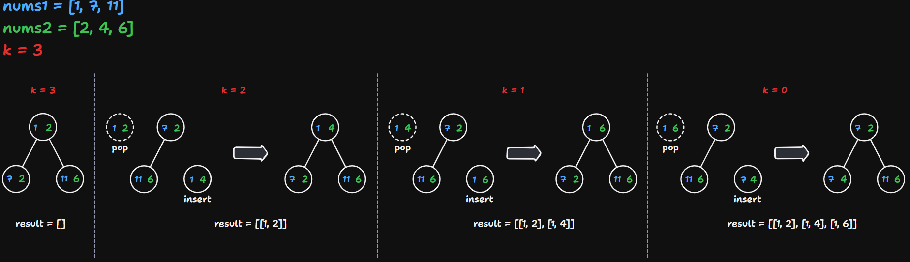

# 373 Find K Pairs with Smallest Sums

Created: October 17, 2024 3:24 PM
Difficulty: Medium
Topics: Array, Heap, Priority Queue
Status: Done

## 📖Description

[Find K Pairs with Smallest Sums](https://leetcode.com/problems/find-k-pairs-with-smallest-sums/description)

## 🤔Intuition

This problem is about to efficiently track the $k$ pairs with the smallest sums from two sorted arrays `nums1` and `nums2` . Typically, the heap-based approach is a better way to solve such $top$-$k$ problems.

However, we don’t need to build a complete min-heap based on `nums1` and `nums2` , because these two array are sorted that we just have to maintain a min-heap which size is $k$ by taking the smallest element from on array and combine it witch the smallest element from the other array.

There will be two ways to solve this problem:

1. Depend on `MinPriorityQueue` from the third-party library `datastructures-js` .
2. Implement a min-heap by ourselves.

## 🖼️Illustration



## 📋Approach One

### Interface Definition

For easily managing the next pair which waiting to be inserted in the `MinPriorityQueue` .

```tsx
interface INode {
		sum: number;
		num1: number;
		nums: number;
		index2: number;
}
```

### Min-Priority Queue Setup And Initialization

Create a min-priority queue `minQueue` to store `INode` elements, and the `priority` is determined to the `INode.sum` .

The min-priority queue `minQueue` will be initialized to pairs formed by each element of `nums1` and the first element of `nums2` .

The size of created `minQueue` will be limited to the minimum value between the length of `nums1` and `k` .

```tsx
const minQueue = new MinPriorityQueue({
		priority: (node: INode) => node.sum;
})

for (let i = 0; i < Math.min(nums1.length, k); ++i) {
    minQueue.enqueue({
        sum: nums1[i] + nums2[0],
        num1: nums1[i],
        num2: nums2[0],
        index2: 0
    });
}
```

### Step By Step Breakdown

- Define the interface `INode` .
- Create an 2D array `result` , which length is `k` , to store the answer pairs.
- Setup and initialize the min-priority queue `minQueue` , which implementation details have been shown in the **Min-Priority Queue Setup And Initialization** part.
- Start a `while` loop for finding `k` smallest pairs,
    - Dequeue the smallest pair from `minQueue` and retrieve its properties `{ num1, num2, index2 }` .
    - Append this smallest pair `[num1, num2]` to the `result` .
    - Calculate the index of next element in `nums2` for next pair.
    - If `nextIndex2` is less than the length of `nums2` , means that this index is available,
        - Create a new `INode` , which `sum` is `num1 + nums2[nextIndex2]` , and enqueue it to the `minQueue` . This allows for exploring further pairs that could potentially have a smaller sum.
    - Update the `k` to `k - 1` .
- Return the `result` .

## 📊Complexity

- **Time Complexity:** $O(k*Logk)$
- **Space Complexity:** $O(k)$

## 🧑🏻‍💻Code

```tsx
function kSmallestPairs1(
    nums1: number[],
    nums2: number[],
    k: number
): number[][] {
    interface INode {
        sum: number;
        num1: number;
        num2: number;
        index2: number;
    }

    const result: number[][] = Array.from({ length: k }, () => []);
    const minQueue = new MinPriorityQueue({
        priority: (node: INode) => node.sum
    });

    for (let i = 0; i < Math.min(nums1.length, k); ++i) {
        minQueue.enqueue({
            sum: nums1[i] + nums2[0],
            num1: nums1[i],
            num2: nums2[0],
            index2: 0
        });
    }

    while (k > 0 && !minQueue.isEmpty()) {
        const { num1, num2, index2 } = minQueue.dequeue().element;

        result[result.length - k] = [num1, num2];

        const nextIndex2: number = index2 + 1;

        if (nextIndex2 < nums2.length) {
            minQueue.enqueue({
                sum: num1 + nums2[nextIndex2],
                num1,
                num2: nums2[nextIndex2],
                index2: nextIndex2
            });
        }

        --k;
    }

    return result;
}
```

## 📋Approach Two

The algorithmic logic of this approach is the same as **Approach One**, but we will implement our own min-heap without using the third-party library.

## 📊Complexity

- **Time Complexity:** $O(k*Logk)$
- **Space Complexity:** $O(k)$

## 🧑🏻‍💻Code

```tsx
interface INode {
    sum: number;
    num1: number;
    num2: number;
    index2: number;
}

class MinHeap {
    private nodes: INode[];

    constructor() {
        this.nodes = [];
    }

    private swap(i: number, j: number): void {
        [this.nodes[i], this.nodes[j]] = [this.nodes[j], this.nodes[i]];
    }

    private shouldSwap(parentIndex: number, childIndex: number): boolean {
        if (parentIndex < 0 || parentIndex >= this.size()) {
            return false;
        }
        if (childIndex < 0 || childIndex >= this.size()) {
            return false;
        }

        return this.nodes[parentIndex].sum > this.nodes[childIndex].sum;
    }

    private heapifyUp(startIndex: number): void {
        let childIndex: number = startIndex;
        let parentIndex: number = (childIndex - 1) >> 1;

        while (this.shouldSwap(parentIndex, childIndex)) {
            this.swap(parentIndex, childIndex);

            childIndex = parentIndex;
            parentIndex = (childIndex - 1) >> 1;
        }
    }

    private heapifyDown(startIndex: number): void {
        const length: number = this.size();
        const leftChildIndex: number = 2 * startIndex + 1;
        const rightChildIndex: number = 2 * startIndex + 2;
        let smallest: number = startIndex;

        if (
            leftChildIndex < length &&
            this.nodes[leftChildIndex].sum < this.nodes[smallest].sum
        ) {
            smallest = leftChildIndex;
        }
        if (
            rightChildIndex < length &&
            this.nodes[rightChildIndex].sum < this.nodes[smallest].sum
        ) {
            smallest = rightChildIndex;
        }
        if (smallest !== startIndex) {
            this.swap(startIndex, smallest);
            this.heapifyDown(smallest);
        }
    }

    isEmpty(): boolean {
        return this.size() === 0;
    }

    size(): number {
        return this.nodes.length;
    }

    insert(value: INode): void {
        this.nodes.push(value);
        this.heapifyUp(this.size() - 1);
    }

    pop(): INode {
        if (this.size() === 1) {
            return this.nodes.pop()!;
        }

        const minValue: INode = this.nodes[0];
        this.nodes[0] = this.nodes.pop()!;

        this.heapifyDown(0);

        return minValue;
    }
}

function kSmallestPairs(
    nums1: number[],
    nums2: number[],
    k: number
): number[][] {
    const result: number[][] = Array.from({ length: k }, () => []);
    const len: number = result.length;
    const minHeap = new MinHeap();

    for (let i = 0; i < Math.min(nums1.length, k); ++i) {
        minHeap.insert({
            sum: nums1[i] + nums2[0],
            num1: nums1[i],
            num2: nums2[0],
            index2: 0
        });
    }

    while (k > 0 && !minHeap.isEmpty()) {
        const { num1, num2, index2 } = minHeap.pop();

        result[len - k] = [num1, num2];

        const nextIndex2: number = index2 + 1;

        if (nextIndex2 < nums2.length) {
            minHeap.insert({
                sum: num1 + nums2[nextIndex2],
                num1,
                num2: nums2[nextIndex2],
                index2: nextIndex2
            });
        }

        --k;
    }

    return result;
}
```

## 🔖Reference

1. [https://github.com/datastructures-js/priority-queue](https://github.com/datastructures-js/priority-queue)
2. [https://github.com/datastructures-js/heap](https://github.com/datastructures-js/heap)