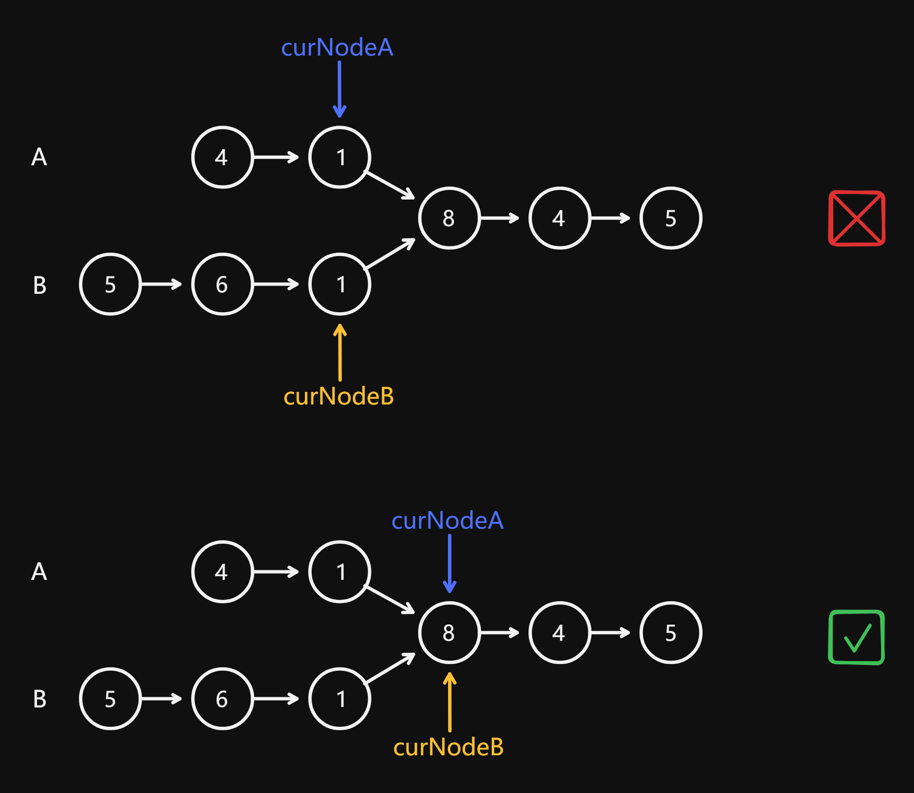

# 160 Intersection of Two Linked Lists

Created: July 26, 2024 5:37 PM
Difficulty: Easy
Topics: Hash Table, Linked List, Two-Pointers

## 📖Description

[Intersection of Two Linked Lists](https://leetcode.com/problems/intersection-of-two-linked-lists/description/)

## 🤔Intuition

This problem is aim to find out the intersection node of two linked lists `headA` and `headB` , all we need to do is create two pointers `curNodeA` and `curNodeB` for representing the two given linked lists, once `curNodeA` equals `curNodeB` , the answer is obtained.

> Some people may confuse the `curNodeA === curNodeB` and `curNodeA.val === curNodeB.val` . We can figure it out from the following diagram:
> 
> 
> 
> 

## 📋Approach One

- Initialize two pointer `curNodeA` and `curNodeB` for representing the two given linked lists `headA` and `headB` .
- Initialize two variables `lenA` and `lenB` for recording the length of the two given linked lists, respectively.
- Calculate the difference of these two linked lists `diff` .
- Redirect `curNode` of the longer length linked list base on the `diff` .
- Start a `while` loop to traverse the linked lists using these two pointers until `curNodeA` is equal to `curNodeB` .
- While `curNodeA` is equal to `curNodeB` , the meeting node is the intersection node (if these two pointer are both equal to `null` , means there is no intersection).

## 📊Complexity

- **Time complexity:** $O(N+M)$
- **Space complexity:** $O(1)$

## 🧑🏻‍💻Code

```tsx
function getIntersectionNode(
    headA: ListNode | null,
    headB: ListNode | null
): ListNode | null {
    let curNodeA: ListNode | null = headA,
        curNodeB: ListNode | null = headB;
    let lenA: number = 0,
        lenB: number = 0;

    while (curNodeA) {
        curNodeA = curNodeA.next;
        ++lenA;
    }

    while (curNodeB) {
        curNodeB = curNodeB.next;
        ++lenB;
    }

    curNodeA = headA;
    curNodeB = headB;

    if (lenB > lenA) {
        [lenB, lenA] = [lenA, lenB];
        [curNodeB, curNodeA] = [curNodeA, curNodeB];
    }

    let diff: number = lenA - lenB;

    while (diff--) {
        curNodeA = curNodeA.next;
    }

    while (curNodeA !== curNodeB) {
        curNodeA = curNodeA.next;
        curNodeB = curNodeB.next;
    }

    return curNodeA;
}
```

## 📋Approach Two

We can use two-pointer technique to solve this problem.

- Initialize two pointer `curNodeA` and `curNodeB` for representing the two given linked lists `headA` and `headB` .
- Start a `while` loop to traverse the linked lists using these two pointers until `curNodeA` is equal to `curNodeB` .
    - If `curNodeA` is `null` , means it has already reached the end of the `headA` , then redirect it to the head of `headB` .
    - If `curNodeB` is `null` , means it has already reached the end of the `headB` , then redirect it to the head of `headA` .
- While `curNodeA` is equal to `curNodeB` , the meeting node is the intersection node (if these two pointer are both equal to `null` , means there is no intersection).

## 📊Complexity

- **Time complexity:** $O(N+M)$
- **Space complexity:** $O(1)$

## 🧑🏻‍💻Code

```tsx
function getIntersectionNode(
    headA: ListNode | null,
    headB: ListNode | null
): ListNode | null {
    let curNodeA: ListNode | null = headA,
        curNodeB: ListNode | null = headB;

    while (curNodeA !== curNodeB) {
        curNodeA = curNodeA ? curNodeA.next : headB;
        curNodeB = curNodeB ? curNodeB.next : headA;
    }

    return curNodeA;
}
```

## 📋Approach Three

We also can use a set to keep track of the nodes we have reached while traversing the two given linked lists.

- Traverse the `headA` and add each node to `set` .
- Traverse the `headB` and check if any node is already in the `set` .
    - If `set.has(headB)` is `true` , means we have already found the intersection node.
- Otherwise, there is no intersection, return `null` .

## 📊Complexity

- **Time complexity:** $O(N+M)$
- **Space complexity:** $O(N)$

## 🧑🏻‍💻Code

```tsx
function getIntersectionNode(
    headA: ListNode | null,
    headB: ListNode | null
): ListNode | null {
    const set: Set<ListNode | null> = new Set<ListNode | null>();

    while (headA) {
        set.add(headA);

        headA = headA.next;
    }

    while (headB) {
        if (set.has(headB)) {
            return headB;
        }

        headB = headB.next;
    }

    return null;
}
```

## 🔖Reference

1. [https://programmercarl.com/面试题02.07.链表相交.html#思路](https://programmercarl.com/%E9%9D%A2%E8%AF%95%E9%A2%9802.07.%E9%93%BE%E8%A1%A8%E7%9B%B8%E4%BA%A4.html#%E6%80%9D%E8%B7%AF)
2. [https://leetcode.com/problems/intersection-of-two-linked-lists/solutions/5548733/efficient-easy-to-understand-intersection-node-detection-99-running-time-python/](https://leetcode.com/problems/intersection-of-two-linked-lists/solutions/5548733/efficient-easy-to-understand-intersection-node-detection-99-running-time-python/?source=vscode)
3. [https://leetcode.com/problems/intersection-of-two-linked-lists/solutions/3432461/c-2-approaches-beats-92-loop-o-1-space/](https://leetcode.com/problems/intersection-of-two-linked-lists/solutions/3432461/c-2-approaches-beats-92-loop-o-1-space/?source=vscode)
4. [https://leetcode.com/problems/intersection-of-two-linked-lists/solutions/5356079/ts-js-two-pointer-solution-with-diagram-with/](https://leetcode.com/problems/intersection-of-two-linked-lists/solutions/5356079/ts-js-two-pointer-solution-with-diagram-with/)