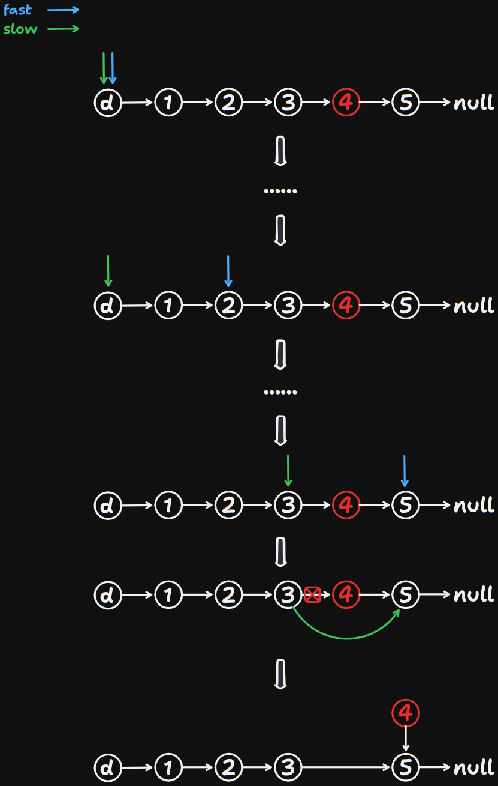
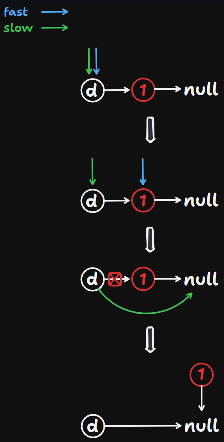

# 19 Remove Nth Node From End of List

Created: September 9, 2024 11:08 AM
Difficulty: Medium
Topics: Linked List, Two-Pointers
Status: Done

## 📖Description

[Remove Nth Node From End of List](https://leetcode.com/problems/remove-nth-node-from-end-of-list/description/)

## 🤔Intuition

This problem requires us to remove the $n^{th}$ node from the end of the given linked list and return it head. For objective 1, we can utilize the two-pointers technology to locate the node waiting to remove. And for objective 2, we will initialize a dummy node and set its `next` pointer to `head` , which is convenient to deal with the situation of only one node in the given list, and return the answer.

## 📋Approach

### Illustration



### Two-Pointers Technology

To solve this problem, we can define two pointers, where fast pointer `fastNode` maintains a lead of `n` nodes over the slow pointer `slowNode` . Iterate over the list, while the `fastNode` reaches the end of the list, we can locate the node waiting to remove from `slowNode.next` , then we point `slowNode.next` to `slowNode.next.next` to remove this node.

### Dummy Node

We initialize a dummy node and set its `next` pointer to `head` , which is convenient to deal with the situation of only one node in the given list.



### Step By Step Breakdown

- Initialize a dummy node `dummyNode` and set its `next` pointer to `head` .
- Initialize two pointers `fastNode` and `slowNode` both point to `dummyNode` .
- Move the `fastNode` based on `n` .
- Iterate over the linked list till `fastNode` reaches the end of linked list.
- Point `slowNode.next` to `slowNode.next.next` to remove the $n^{th}$ node from the end of the given linked list.
- Return `dummyNode.next` .

## 📊Complexity

- **Time Complexity:** $O(N)$
- **Space Complexity:** $O(1)$

## 🧑🏻‍💻Code

```tsx
function removeNthFromEnd(head: ListNode | null, n: number): ListNode | null {
    let dummyNode: ListNode = new ListNode(0, head);
    let fastNode: ListNode = dummyNode;
    let slowNode: ListNode = dummyNode;

    while (fastNode && n--) {
        fastNode = fastNode.next;
    }
    while (fastNode && fastNode.next) {
        fastNode = fastNode.next;
        slowNode = slowNode.next;
    }

    slowNode.next = slowNode.next.next;

    return dummyNode.next;
}
```

## 🔖Reference

None.