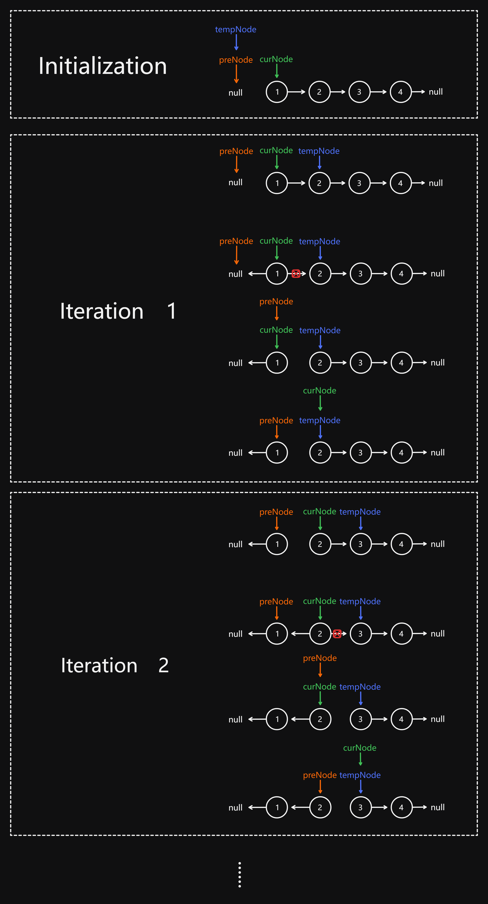

# 206 Reverse Linked List

Created: July 23, 2024 2:40 PM
Difficulty: Easy
Topics: Linked List, Recursion

## 📖Description

[Reverse Linked List](https://leetcode.com/problems/reverse-linked-list/description/)

## 🤔Intuition

To solve this problem, we don’t need to insert or delete node, just need to keep track of nodes, and change each node’s next pointer to the previous node.

## 📋Approach

### **Illustration**



Base on the above illustration, we can summarize an approach process:  

- Initialize three nodes `tempNode` , `curNode` and `preNode` , where `tempNode` and `preNode` are initialized to `null` , and `curNode` is initialized to given `head` .
- Start a `while` loop, iterate through the list till the `curNode` is equal to `null` .
    - Update the `tempNode` point to the `curNode.next` to record the node which will be going to process in the next iteration.
    - Reverse the current node in this iteration by updating the next pointer of `curNode` to point to the `preNode` .
    - Update the `preNode` point to the `cureNode` , then mark it as the next node of the node to be reversed in the next iteration.
    - Update the `curNode` point to the `tempNode` , and prepare to enter the next iteration.
- After the iteration, the given linked list is reversed.

## 📊Complexity

- **Time complexity:** $O(N)$
- **Space complexity:** $O(1)$

## 🧑🏻‍💻Code

```tsx
function reverseList(head: ListNode | null): ListNode | null {
    if (head === null || head.next === null) {
        return head;
    }

    let tempNode: ListNode | null = null,
        curNode: ListNode | null = head,
        preNode: ListNode | null = null;

    while (curNode) {
        tempNode = curNode.next;
        curNode.next = preNode;
        preNode = curNode;
        curNode = tempNode;
    }

    return preNode;
}
```

## 📋Approach Two

We can solve this problem by using recursion.

**Implement a helper function** `recur(preNode, curNode)` **:**

- If the `curNode` is equal to `null` , indicates that the reversal process has been completed.
- Then the process of reversing nodes in the following steps is the same as in approach one, and will not be repeated here.

## 📊Complexity

- **Time complexity:** $O(N)$
- **Space complexity:** $O(N)$

## 🧑🏻‍💻Code

```tsx
function reverseList(head: ListNode | null): ListNode | null {
    const recur = (
        preNode: ListNode | null,
        curNode: ListNode | null
    ): ListNode | null => {
        if (!curNode) {
            return preNode;
        }

        let tempNode: ListNode | null = curNode.next;

        curNode.next = preNode;
        preNode = curNode;
        curNode = tempNode;

        return recur(preNode, curNode);
    };

    return recur(null, head);
}
```

## 📋Approach Three

The approach three also uses recursion, but the difference is this approach will be going to reverse from the end of the given linked list.

## 📊Complexity

- **Time complexity:** $O(N)$
- **Space complexity:** $O(N)$

## 🧑🏻‍💻Code

```tsx
function reverseList(head: ListNode | null): ListNode | null {
    if (head === null || head.next === null) {
        return head;
    }

    let newHead: ListNode | null = null;

    const recur = (node: ListNode | null, preNode: ListNode | null): void => {
        if (node.next === null) {
            newHead = node;
            node.next = preNode;
        } else {
            recur(node.next, node);
            node.next = preNode;
        }
    };

    recur(head, null);

    return newHead;
}
```

## 🔖Reference

1. [https://leetcode.com/problems/reverse-linked-list/solutions/4904337/easy-6-line-iterative-solution-o-n-beats-100-c-3-pointers/](https://leetcode.com/problems/reverse-linked-list/solutions/4904337/easy-6-line-iterative-solution-o-n-beats-100-c-3-pointers/)
2. [https://leetcode.com/problems/reverse-linked-list/solutions/3211778/using-2-methods-iterative-recursive-beats-97-91/](https://leetcode.com/problems/reverse-linked-list/solutions/3211778/using-2-methods-iterative-recursive-beats-97-91/)