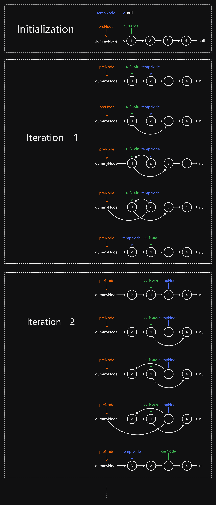

# 206 Reverse Linked List

Created: July 23, 2024 2:40 PM
Difficulty: Easy
Topics: Linked List, Recursion

## 📖Description

[Reverse Linked List](https://leetcode.com/problems/reverse-linked-list/description/)

## 🤔Intuition

To solve this problem, we don’t need to insert or delete node, just need to keep track of nodes, and change each node’s next pointer to the previous node.

## 📋Approach One

### **Illustration**


Base on the above illustration, we can summarize an approach process:  

- Initialize three pointer `tempNode` , `curNode` and `preNode` , where `tempNode` and `preNode` are initialized to `null` , and `curNode` is initialized to given `head` .
- Start a `while` loop, iterate through the list till the `curNode` is equal to `null` .
    - Update the `tempNode` point to the `curNode.next` to record the node which will be going to process in the next iteration.
    - Reverse the current node in this iteration by updating the next pointer of `curNode` to point to the `preNode` .
    - Update the `preNode` point to the `cureNode` , then mark it as the next node of the node to be reversed in the next iteration.
    - Update the `curNode` point to the `tempNode` , and prepare to enter the next iteration.
- After the iteration, the given linked list is reversed.

## 📊Complexity

- **Time complexity:** $O(N)$
- **Space complexity:** $O(1)$

## 🧑🏻‍💻Code

```tsx
function reverseList(head: ListNode | null): ListNode | null {
    if (head === null || head.next === null) {
        return head;
    }

    let tempNode: ListNode | null = null,
        curNode: ListNode | null = head,
        preNode: ListNode | null = null;

    while (curNode) {
        tempNode = curNode.next;
        curNode.next = preNode;
        preNode = curNode;
        curNode = tempNode;
    }

    return preNode;
}
```

## 📋Approach Two

Here introduce another in-place reversal method, which involves dummy node and “head insertion”. In short, this approach takes nodes one by one, removes it from its original place, and inserts it after the dummy node.

### **Illustration**



### Step By Step Breakdown

- Construct a dummy node which points to `head` , and initialize a pointer `preNode` to `dummyNode` .
- Initialize two pointers `tempNode` and `curNode` , where `tempNode` are initialized to `null` , and `curNode` is initialized to `head` .
- Iterate over the given linked list till `curNode.next` is `null` .
    - Point `tempNode` to `curNode.next` for storing the next node to be process.
    - Point `curNode.next` to `tempNode.next` , this operation “remove” the `tempNode` from the list.
    - Point `tempNode.next` to `preNode.next` , which makes `tempNode` become the beginning of the reversing list.
    - Update the pointer `preNode.next` to `tempNode` , then, `tempNode` has already become the first node of the reversing list.
- Return `dummyNode.next` that is the reversed list.

## 📊Complexity

- **Time complexity:** $O(N)$
- **Space complexity:** $O(1)$

## 🧑🏻‍💻Code

```tsx
function reverseList(head: ListNode | null): ListNode | null {
    if (head === null || head.next === null) {
        return head;
    }

    const dummyNode: ListNode = new ListNode(0, head);
    const preNode: ListNode | null = dummyNode;
    let tempNode: ListNode | null = null;
    let curNode: ListNode | null = head;

    while (curNode.next) {
        tempNode = curNode.next;
        curNode.next = tempNode.next;
        tempNode.next = preNode.next;
        preNode.next = tempNode;
    }

    return dummyNode.next;
}
```

## 📋Approach Three

We can solve this problem by using recursion.

**Implement a helper function** `recur(preNode, curNode)` **:**

- If the `curNode` is equal to `null` , indicates that the reversal process has been completed.
- Then the process of reversing nodes in the following steps is the same as in approach one, and will not be repeated here.

## 📊Complexity

- **Time complexity:** $O(N)$
- **Space complexity:** $O(N)$

## 🧑🏻‍💻Code

```tsx
function reverseList(head: ListNode | null): ListNode | null {
    const recur = (
        preNode: ListNode | null,
        curNode: ListNode | null
    ): ListNode | null => {
        if (!curNode) {
            return preNode;
        }

        let tempNode: ListNode | null = curNode.next;

        curNode.next = preNode;
        preNode = curNode;
        curNode = tempNode;

        return recur(preNode, curNode);
    };

    return recur(null, head);
}
```

## 📋Approach Four

The approach three also uses recursion, but the difference is this approach will be going to reverse from the end of the given linked list.

## 📊Complexity

- **Time complexity:** $O(N)$
- **Space complexity:** $O(N)$

## 🧑🏻‍💻Code

```tsx
function reverseList(head: ListNode | null): ListNode | null {
    if (head === null || head.next === null) {
        return head;
    }

    let newHead: ListNode | null = null;

    const recur = (node: ListNode | null, preNode: ListNode | null): void => {
        if (node.next === null) {
            newHead = node;
            node.next = preNode;
        } else {
            recur(node.next, node);
            node.next = preNode;
        }
    };

    recur(head, null);

    return newHead;
}
```

## 🔖Reference

1. [https://leetcode.com/problems/reverse-linked-list/solutions/4904337/easy-6-line-iterative-solution-o-n-beats-100-c-3-pointers/](https://leetcode.com/problems/reverse-linked-list/solutions/4904337/easy-6-line-iterative-solution-o-n-beats-100-c-3-pointers/)
2. [https://leetcode.com/problems/reverse-linked-list/solutions/3211778/using-2-methods-iterative-recursive-beats-97-91/](https://leetcode.com/problems/reverse-linked-list/solutions/3211778/using-2-methods-iterative-recursive-beats-97-91/)