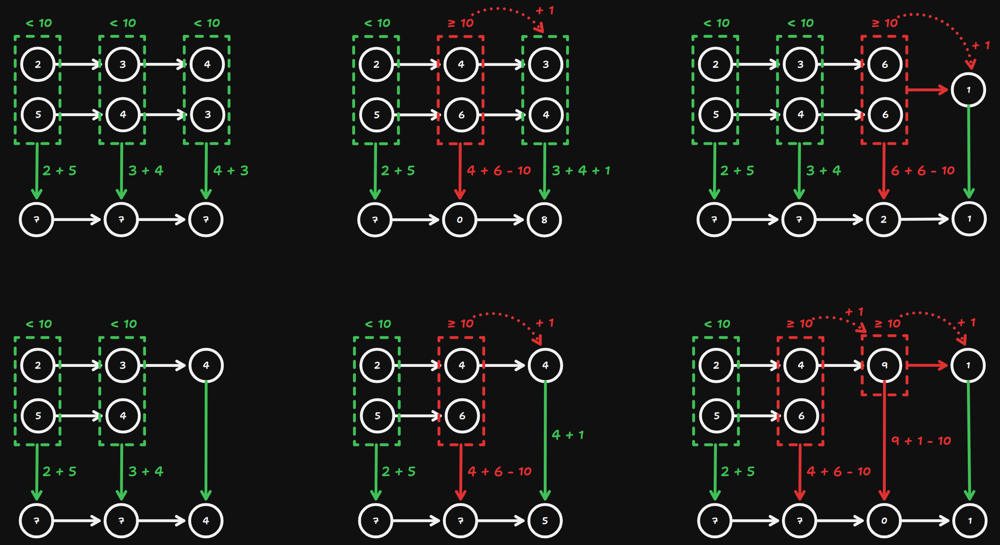

# 2 Add Two Numbers

Created: September 13, 2024 11:13 AM
Difficulty: Medium
Topics: Linked List

## 📖Description

[Add Two Numbers](https://leetcode.com/problems/add-two-numbers/description/)

## 🤔Intuition

The key to solving this problem is to handle the feature of addition in the decimal system correctly, that is, the handling of carry.

## 📋Approach

### Illustration



### Carry Handling

There are two conditions of carry handling:

- The carry will be transferred to the more significant digits, which exists in `l1` or `l2` .
    
    Should add 1 to the sum of the more significant digits `l1.val + l2.val + 1` .
    
- The carry will be transferred to the more significant digits, which does not exist in `l1` and `l2` .
    
    Should create a new node to store this carry and place it in the end of the `result` .
    

### Tail Node Handling

If one of the two given linked lists is null but other is not, link the remaining nodes to the `result` , but the carry handling need to be consider as well.

### Step By Step Breakdown

- Initialize three variables `result` , `resultNode` and `isOver` .
    - `isOver` is used to mark if the next operation requires handle carry.
- Implement a helper function `handleCarry(val)` to handle the whether parameter `val` will create carry.
    - If `val` is no less than 10, it means that `val` will create carry, then set `isOver` to `false` , and return `val - 10` .
    - Otherwise, the `val` will not create carry, just return itself.
- Start a `while` loop util `l1` or `l2` is `null`.
    - Calculate the sum of current two nodes’ value `sum = l1.val + l2.val` .
    - If `isOver` is `true` , indicates that the carry should be transferred to the `sum` this operation, set `sum` to `sum + 1` and reset `isOver` to `false` .
    - Do carry handling for `sum` , and make the return value of function `handleCarry` to be the initialization value of the new node’s value.
    - Link this new node to the `result` .
    - Update `resultNode` to `resultNode .next .`
    - Update `l1` to `l1.next` .
    - Update `l2` to `l2.next` .
- Use `tailNode` to point to the remaining nodes of `l1` or `l2` , or `null`.
- If `tailNode` is not `null` , means there are remaining nodes need to be processed, iterate over them and do the same thing just like what the first `while` loop did.
- If `isOver` is true, we need to add a new node which value is 1 at the end of the `result` .
- Return `result.next` .

## 📊Complexity

- **Time complexity:** $O(Max(N, M))$
- **Space complexity:** $O(Max(N, M))$

## 🧑🏻‍💻Code

```tsx
/**
 * Definition for singly-linked list.
 * class ListNode {
 *     val: number
 *     next: ListNode | null
 *     constructor(val?: number, next?: ListNode | null) {
 *         this.val = (val===undefined ? 0 : val)
 *         this.next = (next===undefined ? null : next)
 *     }
 * }
 */

function addTwoNumbers(
    l1: ListNode | null,
    l2: ListNode | null
): ListNode | null {
    const result: ListNode = new ListNode(0);
    let resultNode: ListNode = result;
    let isOver: boolean = false;

    const handleCarry = (val: number): number =>
        val >= 10 ? ((isOver = true), val - 10) : val;

    while (l1 !== null && l2 !== null) {
        let sum: number = l1.val + l2.val;

        if (isOver) {
            ++sum;
            isOver = false;
        }

        resultNode.next = new ListNode(handleCarry(sum));
        resultNode = resultNode.next;
        l1 = l1.next;
        l2 = l2.next;
    }

    let tailNode: ListNode | null = l1 || l2;

    while (tailNode !== null) {
        if (isOver) {
            ++tailNode.val;
            isOver = false;
        }

        resultNode.next = new ListNode(handleCarry(tailNode.val));
        resultNode = resultNode.next;
        tailNode = tailNode.next;
    }

    if (isOver) {
        resultNode.next = new ListNode(1);
    }

    return result.next;
}
```

## 🔖Reference

None.