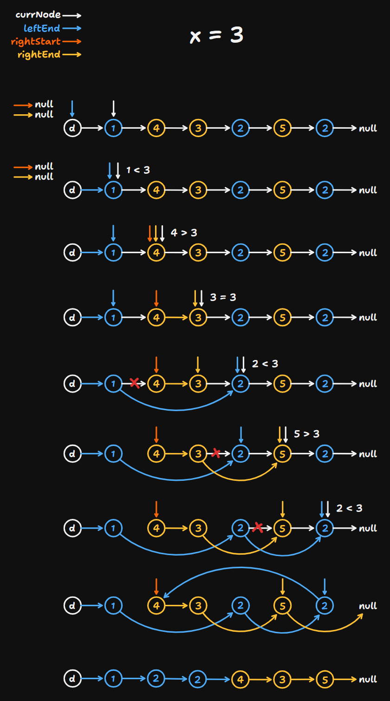

# 86 Partition List

Created: September 18, 2024 11:27 AM
Difficulty: Medium
Topics: Linked List

## 📖Description

[Partition List](https://leetcode.com/problems/partition-list/description)

## 🤔Intuition

To partition the given linked list into two partitions (”less than `x` list” and “greater than or equal to `x`  list“) without change the original relative order of the nodes, we need to determine the nodes where three pointers `leftEnd` , `rightStart` and `rightEnd` point to, through one iteration. Then, relink these two partitions (which `head` → … → `leftEnd` represents ”less than `x` list” and `rightStart` → … → `rightEnd` → `null` represents “greater than or equal to `x`  list“).

## 📋Approach

### Illustration



### Step By Step Breakdown

- If `head` or `head.next` is `null` , just return `head` .
- Initialize a dummy node `dummyNode` which next pointer points to `head` .
- Initialize four pointers `currNode` , `leftEnd` , `rightStart` and `rightEnd` .
    - `currNode` is used to iterate the given linked list, which is initialized by `dummyNode.next` .
    - `leftEnd` , initialized by `dummyNode`, represents the final node in the ”less than `x` list”.
    - `rightStart` and `rightEnd` , both initialized by `null` , represent the first and the final node in the “greater than or equal to `x`  list“.
- Iterate over the given linked list.
    - If `currNode.val` is less than `x` .
        - Update the `leftEnd.next` to `currNode` .
        - Point `leftEnd` to `leftEnd.next` .
    - Else,
        - If `rightEnd` is `null` , it means that `rightEnd` has not been updated from the node in the given list yet.
            - Update `rightStart` to `currNode` .
            - Point `rightEnd` to `currNode` .
        - Otherwise,
            - Update the `rightEnd.next` to `currNode` .
            - Point `rightEnd` to `rightEnd.next` .
    - Iterate next node.
- If `rightEnd` is not `null` , means that the “greater than or equal to `x`  list“ exists, then need to point `rightEnd.next` to `null` .
- Relink the two partitions by pointing `leftEnd.next` to `rightStart` .
- Return the relinked linked list.

## 📊Complexity

- **Time complexity:** $O(N)$
- **Space complexity :**$O(1)$

## 🧑🏻‍💻Code

```tsx
function partition(head: ListNode | null, x: number): ListNode | null {
    if (head === null || head.next === null) {
        return head;
    }

    const dummyNode: ListNode = new ListNode(0, head);
    let currNode: ListNode | null = dummyNode.next;
    let leftEnd: ListNode | null = dummyNode;
    let rightStart: ListNode | null = null;
    let rightEnd: ListNode | null = null;

    while (currNode !== null) {
        if (currNode.val < x) {
            leftEnd.next = currNode;
            leftEnd = leftEnd.next;
        } else {
            if (rightEnd === null) {
                rightStart = currNode;
                rightEnd = currNode;
            } else {
                rightEnd.next = currNode;
                rightEnd = rightEnd.next;
            }
        }

        currNode = currNode.next;
    }

    if (rightEnd !== null) {
        rightEnd.next = null;
    }

    leftEnd.next = rightStart;

    return dummyNode.next;
}
```

## 🔖Reference

None.