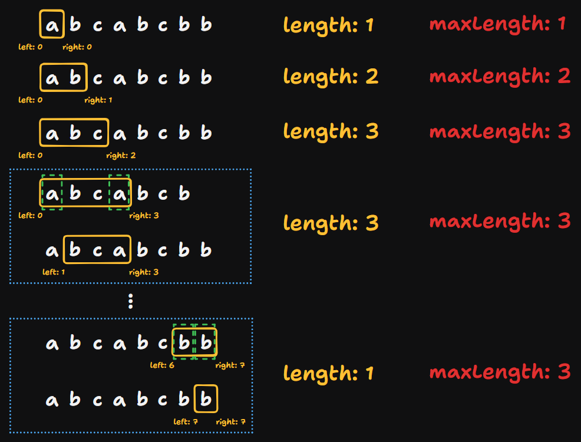

# 3 Longest Substring Without Repeating Characters

Created: September 8, 2024 11:26 PM
Difficulty: Medium
Topics: Hash Table, Sliding Window, String, Two-Pointers

## 📖Description

[Longest Substring Without Repeating Characters](https://leetcode.com/problems/longest-substring-without-repeating-characters/description)

## 🤔Intuition

To solve this problem, we can use Sliding Window technique to track of the maximum length of the substring that without duplication. For duplication detection, a Hash Table will be a good choice.

## 📋Approach

### Illustration



### Valid Window Check

We create a map `indexMap` to record the index of each character in the window.

Once the window contains duplicate elements `indexMap.has(s[right])` , we shrink the window until it no longer contains duplication. The key to this operation is how to update the `left` pointer.

Based on above illustration, we shift `left` pointer one position to the right, and when the `right` pointer reaches an index that would cause the current substring to contain a repetition. So, is the rule for updating the `left` is `left = indexMap.get(s[right]) + 1` ?

The answer is no! Because we need to guarantee that `left` only moves right and never moves left. Specifically, when a duplicate character is found, `left` should be updated to the maximum of its current position or `indexMap.get(s[right]) + 1` .

Think about the situation that given `s` is `'abba'` :


### Step By Step Breakdown

- Create a map `indexMap` to record the index of each character in the window.
- Initialize two pointer `left` and `right` , and a variable `maxLength` to 0.
- Start a `while` loop until the `right` reaches the end of the `s` .
    - If `indexMap.has(s[right])` is true, that means the current character is duplicated, update the `left` to the maximum value between its current position or `indexMap.get(s[right]) + 1` .
    - Update `maxLength` to the maximum value between `maxLength` and `right - left + 1` .
    - Update the index of the current character `s[right]` in the `indexMap` .
    - Set `right` to `right + 1` .
- Return `maxLength` .

## 📊Complexity

- **Time complexity:** $O(N)$
- **Space complexity:** $O(N)$

## 🧑🏻‍💻Code

```tsx
function lengthOfLongestSubstring(s: string): number {
    const indexMap: Map<string, number> = new Map();
    let left: number = 0,
        right: number = 0,
        maxLength: number = 0;

    while (right < s.length) {
        if (indexMap.has(s[right])) {
            left = Math.max(indexMap.get(s[right])! + 1, left);
        }

        maxLength = Math.max(maxLength, right - left + 1);
        indexMap.set(s[right], right);

        ++right;
    }

    return maxLength;
}
```

## 🔖Reference

None.