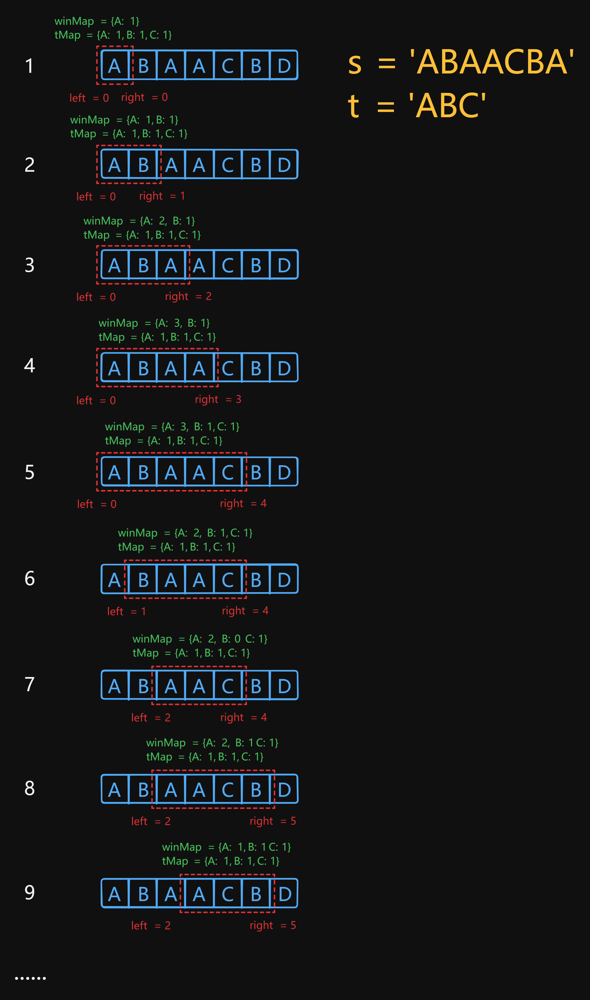

# 76 Minimum Window Substring

Created: July 18, 2024 5:25 PM
Difficulty: Hard
Topics: Hash Table, Sliding Window, String

## 📖Description

[Minimum Window Substring](https://leetcode.com/problems/minimum-window-substring/description/)

## 🤔Intuition

The goal of this problem is to find the minimum window substring of the given string `s` such that contains all characters from string `t` (including duplicates), base on this, using the Sliding Window Technology with two pointers `left` and `right` will be a good intuition for solving this problem.

## 📋Approach

### **Illustration**



### Valid Window Check

If the window already contained all the characters from string `t` , we shrink the window to find out whether there are any other substrings that have the minimum length. So, we need to figure out how to judge the validation of current substring.

- Initialize a map `tMap` to record the frequency of all the elements in given string `t` .
    
    ```tsx
    const tMap: Map<string, number> = new Map();
    for (const c of t) {
        tMap.set(c, (tMap.get(c) ?? 0) + 1);
    }
    ```
    
- Initialize a map `winMap` to dynamically track the frequency of all the elements in current window.
    
    ```tsx
    const winMap: Map<string, number> = new Map();
    ```
    

**Implement a helper function** `isValid()` **:**

```tsx
const isValid = (): boolean => {
    for (const [k, v] of tMap.entries()) {
        if (!winMap.has(k) || winMap.get(k)! < v) {
            return false;
        }
    }

    return true;
};
```

### Sliding **Window Approach**

- Initialize two pointers `left` and `right` , represent the current window.
- Start a `while` loop that continues until `left` pointer reaches the length of `s` , and the window keeps track of the validation of the current substring.
    - The `winMap` keep updating the frequency of the character whose index is `right` and it is contained in `tMap` .
    - If the `left` is no greater than `right` and `isValid()` is return `true` , means the current substring is valid, enter another `while` loop to find out if there are minimum valid substrings.
        - In this `while` loop, update the `minWinLen` by comparing the length of current substring `right - left + 1` and `minWinLen` , which one is smaller. After that, update the `resultLeft` by current `left` .
        - If the `s[left]` is contained in `tMap` , we need to subtract one from its appearance frequency.
        - Then shrink the window by moving pointer `left` to the right.
- After the iteration, the minimum window is found, return a substring of `s` starting from `resultLeft` with length `minWinLen` .

## 📊Complexity

- **Time complexity:** $O(\lvert\sum\rvert*m + n)$
- **Space complexity:** $O(\lvert\sum\rvert)$

## 🧑🏻‍💻Code

```tsx
function minWindow(s: string, t: string): string {
    const sLen: number = s.length;
    const tLen: number = t.length;

    if (sLen === 0 || tLen === 0 || sLen < tLen) {
        return '';
    }

    const tMap: Map<string, number> = new Map();
    const winMap: Map<string, number> = new Map();

    for (const c of t) {
        tMap.set(c, (tMap.get(c) ?? 0) + 1);
    }

    let minWinLen: number = Infinity;
    let left: number = 0;
    let right: number = 0;
    let resultLeft: number = 0;

    const isValid = (): boolean => {
        for (const [k, v] of tMap.entries()) {
            if (!winMap.has(k) || winMap.get(k)! < v) {
                return false;
            }
        }

        return true;
    };

    while (right < sLen) {
        const rightChar: string = s[right];

        if (tMap.has(rightChar)) {
            winMap.set(rightChar, (winMap.get(rightChar) ?? 0) + 1);
        }

        while (left <= right && isValid()) {
            const curLen: number = right - left + 1;

            if (Math.min(minWinLen, curLen) === curLen) {
                minWinLen = curLen;
                resultLeft = left;
            }

            const leftChar: string = s[left];

            if (tMap.has(leftChar)) {
                winMap.set(leftChar, winMap.get(leftChar)! - 1);
            }

            ++left;
        }

        ++right;
    }

    return minWinLen === Infinity
        ? ''
        : s.slice(resultLeft, resultLeft + minWinLen);
}
```

## 📋Optimized Approach

The above approach use two map for validating that brings additional performance overhead. In fact, we can use a variable `count` to maintain that the occurrences number of characters which exist in string `t` in the current substring. When the `count` is equal to the length of `t` , indicates the current substring is valid.

### Initialization

- Initialize an array `tMap` of size 58 which calculated from `'{'.charCodeAt(0) - 'A'.charCodeAt(0)` .
- Create a array `tMap` to record the frequency of all the elements in given string `t` .

```tsx
const lowerBound: number = 'A'.charCodeAt(0);
const tMap: number[] = new Array('{'.charCodeAt(0) - lowerBound).fill(0);

for (const c of t) {
    ++tMap[c.charCodeAt(0) - lowerBound];
}
```

### Sliding **Window Approach**

- Initialize two pointers `left` and `right` , represent the current window.
- Initialize a variable `count` and the value is 0.
- Start a `for` loop that continues until `right` pointer reaches the length of `s` , and the window keeps track of the validation of the current substring.
    - If the frequency of character whose index is `rightIndex` in `tMap` is greater than 0, means this character presented in the window is also contained in `tMap` , update the `count` by `++count` .
    - Decrease the frequency by `--tMap[rightIndex]` (If the `tMap[rightIndex]` is `undefined` , it won’t have any negative impact, ignore it).
    - If the `count` is equal to the length of `t` , means the current window substring is valid, enter a `while` loop.
        - In this `while` loop, update the `minWinLen` by comparing the length of current window `right - left + 1` and `minWinLen` , which one is smaller. After that, update the `resultLeft` by current `left` .
        - If `tMap[leftIndex]` is equal to 0, means the current window substring has lost a necessary character, then update the `count` by `--count` .
        - Increase the frequency by `++tMap[leftIndex]` (If the `tMap[leftIndex]` is `undefined` , it won’t have any negative impact, ignore it).
        - Then shrink the window by moving pointer `left` to the right.
- After the iteration, the minimum window is found, return a substring of `s` starting from `resultLeft` with length `minWinLen` .

## 📊Complexity

- **Time complexity:** $O(m + n)$
- **Space complexity:** $O(\lvert\sum\rvert)$

## 🧑🏻‍💻Code

```tsx

function minWindow(s: string, t: string): string {
    const sLen: number = s.length;
    const tLen: number = t.length;

    if (sLen === 0 || tLen === 0 || sLen < tLen) {
        return '';
    }

    const lowerBound: number = 'A'.charCodeAt(0);
    const tMap: number[] = new Array('{'.charCodeAt(0) - lowerBound).fill(0);

    for (const c of t) {
        ++tMap[c.charCodeAt(0) - lowerBound];
    }

    let minWinLen: number = Infinity;
    let resultLeft: number = 0;

    for (let left = 0, right = 0, count = 0; right < sLen; ++right) {
        const rightIndex: number = s[right].charCodeAt(0) - lowerBound;

        if (tMap[rightIndex] > 0) {
            ++count;
        }

        --tMap[rightIndex];

        while (count === tLen) {
            const curLen: number = right - left + 1;

            if (Math.min(minWinLen, curLen) === curLen) {
                minWinLen = curLen;
                resultLeft = left;
            }

            const leftIndex: number = s[left].charCodeAt(0) - lowerBound;

            if (tMap[leftIndex] === 0) {
                --count;
            }

            ++tMap[leftIndex];
            ++left;
        }
    }

    return minWinLen === Infinity
        ? ''
        : s.slice(resultLeft, resultLeft + minWinLen);
}
```

## 🔖Reference

1. [https://leetcode.com/problems/minimum-window-substring/solutions/4673541/beats-100-explained-any-language-by-prodonik/](https://leetcode.com/problems/minimum-window-substring/solutions/4673541/beats-100-explained-any-language-by-prodonik/?source=vscode)
2. [https://leetcode.cn/problems/minimum-window-substring/solutions/2713911/liang-chong-fang-fa-cong-o52mn-dao-omnfu-3ezz/](https://leetcode.cn/problems/minimum-window-substring/solutions/2713911/liang-chong-fang-fa-cong-o52mn-dao-omnfu-3ezz/)