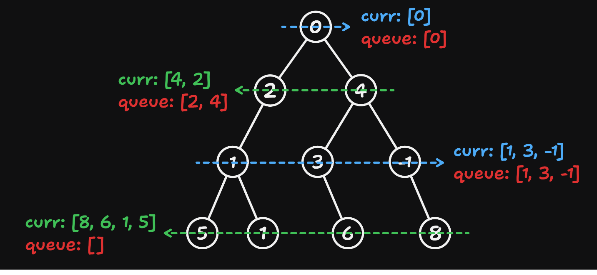

# 103 Binary Tree Zigzag Level Order Traversal

Created: September 30, 2024 11:24 AM
Difficulty: Medium
Topics: Binary-Tree, Breadth-First Search, Tree
Status: Done

## 📖Description

[Binary Tree Zigzag Level Order Traversal](https://leetcode.com/problems/binary-tree-zigzag-level-order-traversal/description)

## 🤔Intuition

To solve this problem, we only need to make some changes during the level order traversal process to obtain reversed traversal of all nodes from a certain level.

## 📋Approach One

This approach get the traversal from right to left by changing the order of adding left and right child nodes. And we need to modify the behavior of the `queue` which is used in level order traversal, enable it to insert elements at the head.

### Illustration



### Step By Step Breakdown

- If `root` is `null` , return an empty array.
- Initialize `result` to `[[root.val]]` .
- Create a `queue` and enqueue the `root` .
- Define a variable `reversalFlag` which is initialized to `true` , and we use it to mark the process that needs to be traversed from right to left.
- Start a `while` loop, util there are no more nodes in `queue` .
    - Record the current length of `queue` .
    - Create an empty array `currLevel` to store the traversal result of current level.
    - Traverse the nodes of current level.
        - If `reversalFlag` is `true` , means that the traversal order in this level is from right to left.
            - Get out the node from the end of `queue` .
            - Attempt to add its child nodes to `currLevel` and the head of `queue` in right to left order.
        - Else, the traversal order in this level is from left to right.
            - Get out the node from the head of `queue` .
            - Attempt to add its child nodes to `currLevel` and the end of `queue` in right to left order.
    - If the `currLevel` is not empty, then append it to the `result` .
    - Update `reversalFlag` to `!reversalFlag` .
- Return `result` .

## 📊Complexity

- **Time Complexity:** $O(N)$
- **Space Complexity:** $O(N)$

## 🧑🏻‍💻Code

```tsx
/**
 * Definition for a binary tree node.
 * class TreeNode {
 *     val: number
 *     left: TreeNode | null
 *     right: TreeNode | null
 *     constructor(val?: number, left?: TreeNode | null, right?: TreeNode | null) {
 *         this.val = (val===undefined ? 0 : val)
 *         this.left = (left===undefined ? null : left)
 *         this.right = (right===undefined ? null : right)
 *     }
 * }
 */

function zigzagLevelOrder(root: TreeNode | null): number[][] {
    if (root === null) {
        return [];
    }

    const result: number[][] = [[root.val]];
    const queue: TreeNode[] = [root];
    let reversalFlag: boolean = true;

    while (queue.length) {
        const size: number = queue.length;
        const currLevel: number[] = [];

        for (let i = 0; i < size; ++i) {
            if (reversalFlag) {
                const { left, right } = queue.pop()!;

                if (right !== null) {
                    currLevel.push(right.val);
                    queue.unshift(right);
                }
                if (left !== null) {
                    currLevel.push(left.val);
                    queue.unshift(left);
                }
            } else {
                const { left, right } = queue.shift()!;

                if (left !== null) {
                    currLevel.push(left.val);
                    queue.push(left);
                }
                if (right !== null) {
                    currLevel.push(right.val);
                    queue.push(right);
                }
            }
        }

        currLevel.length && result.push(currLevel);

        reversalFlag = !reversalFlag;
    }

    return result;
}
```

## 📋Approach Two

In fact, we only need to reverse the `currLevel` before appending it to the `result` when `reversalFlag` is `true` .

```tsx
reversalFlag && currLevel.reverse();
```

## 📊Complexity

- **Time Complexity:** $O(N)$
- **Space Complexity:** $O(N)$

## 🧑🏻‍💻Code

```tsx
/**
 * Definition for a binary tree node.
 * class TreeNode {
 *     val: number
 *     left: TreeNode | null
 *     right: TreeNode | null
 *     constructor(val?: number, left?: TreeNode | null, right?: TreeNode | null) {
 *         this.val = (val===undefined ? 0 : val)
 *         this.left = (left===undefined ? null : left)
 *         this.right = (right===undefined ? null : right)
 *     }
 * }
 */

function zigzagLevelOrder(root: TreeNode | null): number[][] {
    if (root === null) {
        return [];
    }

    const result: number[][] = [[root.val]];
    const queue: TreeNode[] = [root];
    let reversalFlag: boolean = true;

    while (queue.length) {
        const size: number = queue.length;
        const currLevel: number[] = [];

        for (let i = 0; i < size; ++i) {
            const { left, right } = queue.shift()!;

            if (left !== null) {
                currLevel.push(left.val);
                queue.push(left);
            }
            if (right !== null) {
                currLevel.push(right.val);
                queue.push(right);
            }
        }

        reversalFlag && currLevel.reverse();
        currLevel.length && result.push(currLevel);

        reversalFlag = !reversalFlag;
    }

    return result;
}
```

## 🔖Reference

None.