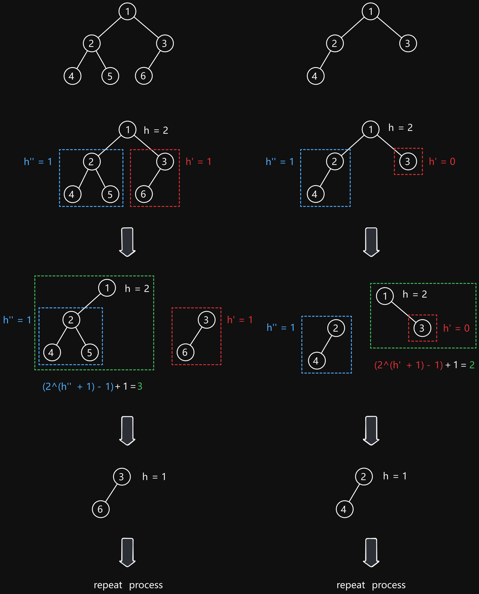

# 222 Count Complete Tree Nodes

Created: September 24, 2024 4:34 PM
Difficulty: Easy
Topics: Recursion, Tree
Status: Done

## 📖Description

[Count Complete Tree Nodes](https://leetcode.com/problems/count-complete-tree-nodes/description/)

## 🤔Intuition

To solve this problem, we need to be familiar with the features of a complete binary tree, for example:

- Every level, except possibly the last, is completely filled in a complete binary tree, and all nodes in the last level are as far left as possible.

We can draw two conclusions from it:

1. If the height of right subtree is the same as left subtree, it indicates that the left subtree is a prefect binary tree.
2. If the height of right subtree is not the same as left subtree, it indicates that the right subtree is a perfect binary tree but the left subtree is not.

Based on above mention, we can count the complete binary tree nodes by calculating the number of nodes in the perfect subtree (where is calculated by $2^{(h + 1)} - 1$ ) and adding recursively the number of nodes in another subtree.

## 📋Approach One

### Height Calculation

The `getHeight(root)` function calculates the height of the tree. It counts how many edges are there from the root to the deepest left leaf, and we often treat height as zero-based (where the root is at height 0).

```tsx
const getHeight = (root: TreeNode): number => {
    return root === null ? -1 : 1 + getHeight(root.left);
};
```

### Illustration



This illustration shows two conclusions mentioned in the Intuition, respectively. Based on it, we can simply describe the process as “halve the tree, count the nodes of perfect binary tree, and repeat the process for another subtree”.

### Step By Step Breakdown

- Implement a helper function `getHeight(root)` to calculate the height of a complete binary tree.
- Initialize two variables `count` and `h` , the `h` represents the height of current `root` .
- Start a `while` loop until there are no accessible nodes.
    - Check if the height of the right subtree is equal to `h - 1` . If `true` , it means that the left subtree is a prefect binary tree, and we can count its nodes by `1 << h` (equivalent to `2^(h + 1) - 1` ). Then move to the right subtree.
    - Otherwise, the left subtree isn’t fully populated, and we count the all nodes of right subtree by `1 << (h - 1)` . Then move to the left subtree.
    - Decrease `h` by `1` to reflect that we are moving down a level in the tree.
- Return `count` .

## 📊Complexity

- **Time complexity:** $O(log^2N)$
- **Space complexity:** $O(logN)$

## 🧑🏻‍💻Code

```tsx
function countNodes(root: TreeNode | null): number {
    const getHeight = (root: TreeNode): number => {
        return root === null ? -1 : 1 + getHeight(root.left);
    };

    let count: number = 0;
    let h: number = getHeight(root);

    while (root) {
        if (getHeight(root.right) === h - 1) {
            count += 1 << h; // The count of left subtree plus one root node.
            root = root.right;
        } else {
            count += 1 << (h - 1); // The count of right subtree plus one root node.
            root = root.left;
        }

        --h;
    }

    return count;
}
```

## 📋Approach Two

The Approach Two is recursive version, but it will calculate `h` repeatedly in every recursive step.

## 📊Complexity

- **Time complexity:** $O(log^2N)$
- **Space complexity:** $O(logN)$

## 🧑🏻‍💻Code

```tsx
function countNodes(root: TreeNode | null): number {
    const getHeight = (root: TreeNode): number => {
        return root === null ? -1 : 1 + getHeight(root.left);
    };

    const h: number = getHeight(root);

    return h < 0
        ? 0
        : getHeight(root.right) === h - 1
        ? (1 << h) + countNodes(root.right)
        : (1 << (h - 1)) + countNodes(root.left);
}
```

## 🔖Reference

1. [https://leetcode.com/problems/count-complete-tree-nodes/solutions/61958/concise-java-solutions-o-log-n-2](https://leetcode.com/problems/count-complete-tree-nodes/solutions/61958/concise-java-solutions-o-log-n-2)