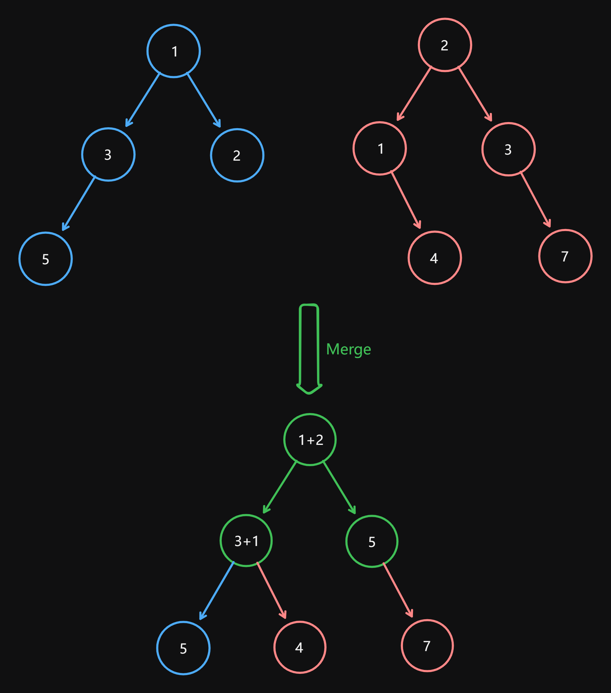

# 617 Merge Two Binary Trees

Created: July 31, 2024 9:52 AM
Difficulty: Easy
Topics: Binary-Tree, Depth-First Search, Tree

## 📖Description

[Merge Two Binary Trees](https://leetcode.com/problems/merge-two-binary-trees/description)

## 🤔Intuition

This problem mainly examines the traversal of binary trees, then we can use DFS technology. All we need to focus is the terminal conditions.

## 📋Approach

### **Illustration**



### Terminal Conditions

- If the `root1` and `root2` are both `null` , return `null` .
- If the `root1` is `null` , the `root2` is not, return `root2` .
- If the `root2` is `null` , the `root1` is not, return `root1` .

> **For the terminal conditions, we can merge all the conditions into one:**
> 
> 
> ```tsx
> if (!root1 || !root2) {
>     return root1 || root2;
> }
> ```
> 

### Recursion

- If the current node exists for both trees, we add the values in the current nodes of both the trees and update the value in the current node of the first tree `root1.val += root2.val` to reflect this sum obtained.
- Recursively call `mergeTrees` to continue traverse the trees and update the `root1.left` and `root1.right` .

## 📊Complexity

- **Time complexity:** $O(N)$
- **Space complexity:** $O(N)$

## 🧑🏻‍💻Code

```tsx
/**
 * Definition for a binary tree node.
 * class TreeNode {
 *     val: number
 *     left: TreeNode | null
 *     right: TreeNode | null
 *     constructor(val?: number, left?: TreeNode | null, right?: TreeNode | null) {
 *         this.val = (val===undefined ? 0 : val)
 *         this.left = (left===undefined ? null : left)
 *         this.right = (right===undefined ? null : right)
 *     }
 * }
 */
function mergeTrees(
    root1: TreeNode | null,
    root2: TreeNode | null
): TreeNode | null {
    if (!root1 || !root2) {
        return root1 || root2;
    }

    root1.val += root2.val;
    root1.left = mergeTrees(root1.left, root2.left);
    root1.right = mergeTrees(root1.right, root2.right);

    return root1;
}
```

```cpp
/**
 * Definition for a binary tree node.
 * struct TreeNode {
 *     int val;
 *     TreeNode *left;
 *     TreeNode *right;
 *     TreeNode() : val(0), left(nullptr), right(nullptr) {}
 *     TreeNode(int x) : val(x), left(nullptr), right(nullptr) {}
 *     TreeNode(int x, TreeNode *left, TreeNode *right) : val(x), left(left), right(right) {}
 * };
 */
class Solution {
public:
    TreeNode* mergeTrees(TreeNode* root1, TreeNode* root2) {
        if (!root1 || !root2) {
            return root1 ? root1 : root2;
        }

        root1->val += root2->val;
        root1->left = mergeTrees(root1->left, root2->left);
        root1->right = mergeTrees(root1->right, root2->right);

        return root1;
    }
};
```

## 🔖Reference

1. [https://leetcode.com/problems/merge-two-binary-trees/editorial](https://leetcode.com/problems/merge-two-binary-trees/editorial)
2. [https://leetcode.com/problems/merge-two-binary-trees/solutions/5420428/49-recursive-dfs-in-6-lines-short-sweet-code-c-code-reference](https://leetcode.com/problems/merge-two-binary-trees/solutions/5420428/49-recursive-dfs-in-6-lines-short-sweet-code-c-code-reference/?source=vscode)