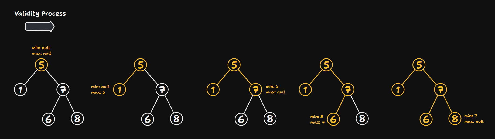

# 98 Validate Binary Search Tree

Created: October 7, 2024 12:32 PM
Difficulty: Medium
Topics: Binary-Tree, Breadth-First Search, Depth-First Search, Tree
Status: Done

## 📖Description

[Validate Binary Search Tree](https://leetcode.com/problems/validate-binary-search-tree/description/)

## 🤔Intuition

To validate if a binary tree is a **Binary Search Tree (BST)**, we can perform an in-order traversal and ensure that the values are in sorted order (ascending order). Alternatively, we can use a recursive approach that checks if each node’s value satisfy the rule that for each node, its value must be greater than the maximum value of its left subtree and less than the minimum value of its right subtree.

## 📋Approach

The intuitive approach is to traverse the given binary tree in-order and store the values of the accessed nodes in an array. After that, if the array is sorted in ascending order, it means that the given binary tree is a **BST**.

### In-order Traversal

In-order traversal visits the node in following order: 

1. Traverse the left subtree.
2. Access the root node.
3. Traverse the right subtree.

So, we can quickly implement the helper function `inorder(root)` :

```tsx
const inorder = (root: TreeNode | null): void => {
    if (root === null) {
        return;
    }

    const { left, right, val } = root;

    inorder(left);
    path.push(val);
    inorder(right);
};
```

### Ascending Order Check

Implement a helper function `isAscending()` for checking if an array is ascending order is not such difficult.

```tsx
const isAscending = (): boolean => {
    const len: number = path.length;

    if (len === 0 || len === 1) {
        return true;
    }

    for (let i = 1; i < len; ++i) {
        if (path[i - 1] >= path[i]) {
            return false;
        }
    }

    return true;
};
```

### Step By Step Breakdown

- Create an empty array `path` to store the value of accessed nodes during the in-order traversal process.
- Implement the helper function `inorder(root)` , which implementation has shown in the above part.
- Implement the helper function `isAscending()` , which implementation has also shown in the above part.
- Call `inorder(root)` to start the in-order traversal.
- Return the result from calling `isAscending()` .

## 📊Complexity

- **Time Complexity:** $O(N)$
- **Space Complexity:** $O(N)$

## 🧑🏻‍💻Code

```tsx
function isValidBST(root: TreeNode | null): boolean {
    const path: number[] = [];
    const inorder = (root: TreeNode | null): void => {
        if (root === null) {
            return;
        }

        const { left, right, val } = root;

        inorder(left);
        path.push(val);
        inorder(right);
    };
    const isAscending = (): boolean => {
        const len: number = path.length;

        if (len === 0 || len === 1) {
            return true;
        }

        for (let i = 1; i < len; ++i) {
            if (path[i - 1] >= path[i]) {
                return false;
            }
        }

        return true;
    };

    inorder(root);

    return isAscending();
}
```

## 📋Optimized Approach

The recursive approach check if the binary tree rooted by `root` is a **BST** by ensuring that each node’s value adheres to the constraints of being greater than the maximum value of its left subtree and less than the minimum value of its right subtree.

Different to above approach, recursive approach can check the validity on-the-fly without using an array to store all values.

### Illustration



### Validity Check

We implement a recursive helper function `validateBST(root, min, max)` :

- Provide a base case, if `root` is `null` , it means that we are reached a leaf node or the tree itself is empty (an empty tree is considered a **BST**), then return `true` .
- Check if the current visited node’s value violate the rule mentioned in Intuition part.
    - If the `min` value is not `null` and the current node’s value `root.val` is not greater than `min` , it means the node’s value is not greater that the allowed minimum, the return `false` .
    - If the `max` value is not `null` and the current node’s value `root.val` is not less than `max` , it means the node’s value is not less that the allowed maximum, the return `false` .
- Validate the left and right subtree recursively.
    - `validateBST(root.left, min, root.val)` : This checks the left subtree, setting the `max` value to the current node’s value `root.val` . To ensure each node in the left subtree must be less than the `root.val` .
    - `validateBST(root.right, root.val, max)` : This checks the right subtree, setting the `min` value to the current node’s value `root.val` . To ensure each node in the right subtree must be greater than the `root.val` .

## 📊Complexity

- **Time Complexity:** $O(N)$
- **Space Complexity:** $O(LogN)$

## 🧑🏻‍💻Code

```tsx
function isValidBST(root: TreeNode | null): boolean {
    const validateBST = (
        root: TreeNode | null,
        min: number | null,
        max: number | null
    ): boolean => {
        if (root === null) {
            return true;
        }

        const { left, right, val } = root;

        if ((min !== null && val <= min) || (max !== null && val >= max)) {
            return false;
        }

        return validateBST(left, min, val) && validateBST(right, val, max);
    };

    return validateBST(root, null, null);
}
```

## 🔖Reference

1. [https://www.geeksforgeeks.org/check-array-represents-inorder-binary-search-tree-not/](https://www.geeksforgeeks.org/check-array-represents-inorder-binary-search-tree-not/)