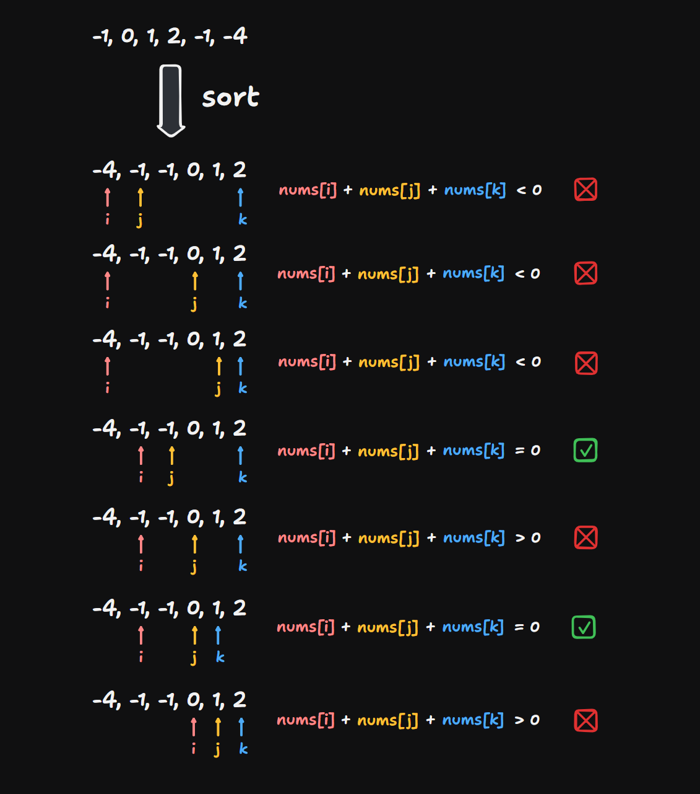

# 15 3Sum

Created: September 4, 2024 5:09 PM
Difficulty: Medium
Topics: Array, Two-Pointer

## 📖Description

[3Sum](https://leetcode.com/problems/3sum/description)

## 🤔Intuition

To solve this problem, we can use the two-pointer technique to find all unique triples in the given array `nums` that sum up to 0.

## 📋Approach One

### Illustration



### Step By Step Breakdown

- Sort the array `nums` in ascending order.
- Start an outer `for` loop to iterate over `nums` till `i` reaches `len - 2` .
    - If the current element `nums[i]` is greater than 0, means that there cannot be triples that sum up to 0, then `break` the loop.
    - If the current element `nums[i]` is equal to its previous one `nums[i]` , indicates that there will a duplicate result, if there is an valid triple, so skip it.
    - Set pointer `j` to `i + 1` , represent the index of the second element of the triple to be verified.
    - Set pointer `k` to `len - 1` , represent the index of the third element of the triple to be verified.
    - Start an inner `while` loop till `j < k` .
        - Create a variable `sum` to record the current sum `nums[i] + nums[j] + nums[k]` .
        - If the `sum` is greater than 0, set `k` to `k - 1` .
        - Else if the `sum` is less than 0, set `j` to `j + 1` .
        - Otherwise, it means that a valid triple has been found, then append it to the `result` , and shrink the search interval (skip duplicate elements with two `while` loops separately).
- After that, return the `result` .

## 📊Complexity

- **Time complexity:** $O(N^2)$
- **Space complexity:** $O(N)$

## 🧑🏻‍💻Code

```tsx
function threeSum(nums: number[]): number[][] {
    const result: number[][] = [];
    const len: number = nums.length;

    nums.sort((a, b) => a - b);

    for (let i = 0, j = -1, k = -1; i < len - 2; ++i) {
        if (nums[i] > 0) {
            break;
        }

        if (i > 0 && nums[i] === nums[i - 1]) {
            continue;
        }

        j = i + 1;
        k = len - 1;

        while (j < k) {
            const sum: number = nums[i] + nums[j] + nums[k];

            if (sum > 0) {
                --k;
            } else if (sum < 0) {
                ++j;
            } else {
                result.push([nums[i], nums[j], nums[k]]);

                do {
                    --k;
                } while (j < k && nums[k] === nums[k + 1]);
                do {
                    ++j;
                } while (j < k && nums[j] === nums[j - 1]);
            }
        }
    }

    return result;
}
```

## 📋Approach Two

The another approach is to use Hash Table to determine whether `-(nums[i] - nums[j])` has appeared in the given array `nums` . However, this approach is not very efficient, so we will not provide a detailed explanation.

## 📊Complexity

- **Time complexity:** $O(N^2)$
- **Space complexity:** $O(N)$

## 🧑🏻‍💻Code

```tsx
function threeSum(nums: number[]): number[][] {
    const result: number[][] = [];
    const len: number = nums.length;
    const set: Set<number> = new Set();
    const resultMap: Map<number, Set<number>> = new Map();
    let i: number, j: number, k: number;

    nums.sort((a, b) => a - b);

    for (j = 1; j < len - 1; ++j) {
        set.clear();

        for (i = 0; i < j; ++i) {
            set.add(nums[i] + nums[j]);
        }
        for (k = j + 1; k < len; ++k) {
            if (set.has(-nums[k])) {
                const two: number = nums[j];
                const three: number = nums[k];
                const one: number = -two - three;

                if (!resultMap.get(one)?.has(two)) {
                    resultMap.set(one, new Set([two]));

                    result.push([one, two, three]);
                }
            }
        }
    }

    return result;
}
```

## 🔖Reference

1. [https://programmercarl.com/0015.三数之和.html](https://programmercarl.com/0015.%E4%B8%89%E6%95%B0%E4%B9%8B%E5%92%8C.html)
2. [https://leetcode.com/problems/3sum/solutions/5055810/video-two-pointer-solution](https://leetcode.com/problems/3sum/solutions/5055810/video-two-pointer-solution)