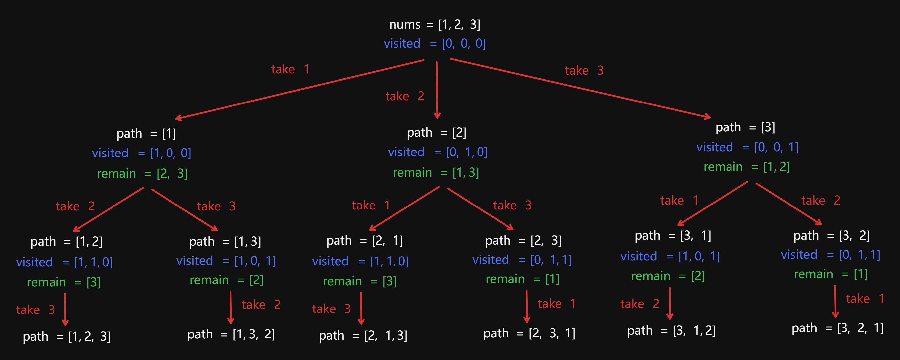
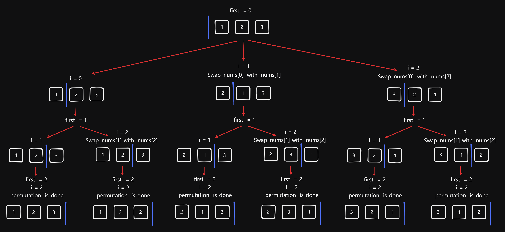

# 46 Permutations

Created: July 2, 2024 5:10 PM
Select: Medium
Topics: Array, Backtracking

## 📖Description

[**Permutations**](https://leetcode.com/problems/permutations/description)

## 🤔Intuition

This question belongs to another application scenario of the backtracking approach —— permutation. Unlike solving the subset and combination problems with iterate through the remaining elements in `nums` starting from the given `startIndex` , to find out all the possible permutations, we need to search from scratch in each recursion. Consider this case `[1,2,3]` , we can get a target permutation `[1,2,3]` after the first loop finish, but we still need to include element `1` in the another target permutation `[2,1,3]` once again during the second loop. Therefore, there is no need to use `startIndex` to initialize the counter variable in for loop.

For avoiding duplicates, we need to use an array to mark the taken elements.

## 📋Approach

### Recursion Tree



### Recursive Backtracking

**Implement a recursive function** `backtrack(path)` **:**

- If the length of `path` is equal to `nums.length` , then we know that we have reached a new permutation, so we just need to append it to the `result` .
- Iterate over all elements each time from zero to `nums.length` .
- If the `visited[i]` is `true` , then this indicates, that we already take this element in the current permutation, skip it.
- Mark the `num[i]` as taken and append it to the `path`.
- Recursively call `backtrack` with updated `path` .

## 📊Complexity

- **Time complexity:** $O(N*N!)$
- **Space complexity:** $O(N*N!)$

## 🧑🏻‍💻Code

```tsx
function permute(nums: number[]): number[][] {
    const length = nums.length;

    const result: number[][] = [];
    const visited: boolean[] = new Array<boolean>(length).fill(false);

    const backtrack = (path: number[]): void => {
        if (path.length === length) {
            result.push([...path]);

            return;
        }

        for (let i = 0; i < length; ++i) {
            if (visited[i]) {
                continue;
            }

            path.push(nums[i]);
            visited[i] = true;
            backtrack(path);
            visited[i] = false;
            path.pop();
        }
    };

    backtrack([]);

    return result;
}
```

## 📋Optimized Approach

### Recursion Tree



### Recursive Backtracking

The above approach uses an array to mark the taken elements for avoiding the duplicates. So, is there a approach that doesn't use this extra array ? 

The answer is yes. We can divide the given `nums` into two parts, the left represents the elements that have already taken, and the right represents the elements that wait to be take. When backtracking, we only need to dynamically maintain this array.

For each index `i` in the range `[first, nums.lenght]` :

- Swap `nums[first]` with `nums[i]` .
- Recursively generate permutations for remaining indices.
- Swap back to restore original order.

## 📊Complexity

- **Time complexity:** $O(N*N!)$
- **Space complexity:** $O(N*N!)$

## 🧑🏻‍💻Code

```tsx
function permute(nums: number[]): number[][] {
    const length = nums.length;

    const result: number[][] = [];

    const backtrack = (first: number): void => {
        if (first === length) {
            result.push([...nums]);

            return;
        }

        for (let i = first; i < length; ++i) {
            [nums[i], nums[first]] = [nums[first], nums[i]];
            backtrack(first + 1);
            [nums[i], nums[first]] = [nums[first], nums[i]];
        }
    };

    backtrack(0);

    return result;
}
```

## 🔖Reference

1. [https://programmercarl.com/0046.全排列.html#算法公开课](https://programmercarl.com/0046.%E5%85%A8%E6%8E%92%E5%88%97.html#%E7%AE%97%E6%B3%95%E5%85%AC%E5%BC%80%E8%AF%BE)
2. [https://leetcode.com/problems/permutations/solutions/5152552/video-simple-backtracking-solution/](https://leetcode.com/problems/permutations/solutions/5152552/video-simple-backtracking-solution/)
3. [https://leetcode.com/problems/permutations/solutions/3475963/backtracking-o-n-time-and-o-n-space-easiest-beginner-friendly-sol/](https://leetcode.com/problems/permutations/solutions/3475963/backtracking-o-n-time-and-o-n-space-easiest-beginner-friendly-sol/)
4. [https://leetcode.com/problems/permutations/solutions/993970/python-4-approaches-visuals-time-complexity-analysis/](https://leetcode.com/problems/permutations/solutions/993970/python-4-approaches-visuals-time-complexity-analysis/)