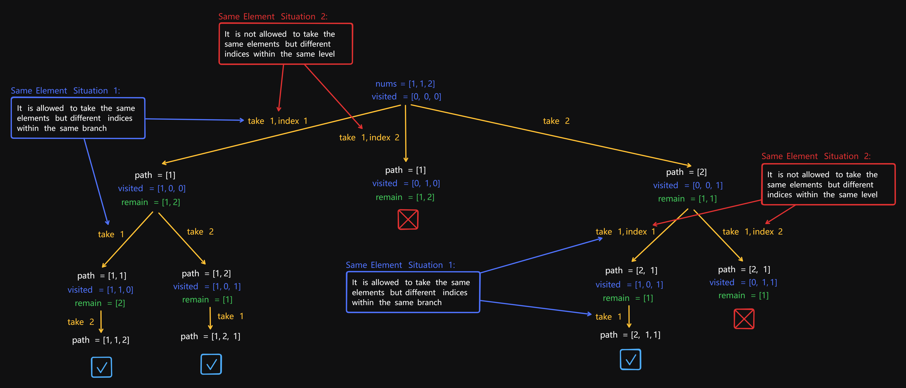

# 47 Permutations II

Created: July 2, 2024 2:28 PM
Select: Medium
Topics: Array, Backtracking

## 📖Description

[**Permutations II**](https://leetcode.com/problems/permutations-ii/description)

## 🤔Intuition

This problem is similar to [46 **Permutations**](https://www.notion.so/46-Permutations-3e83e1fc88994abc8bcea24124bf0921?pvs=21), but the difference is that the given `nums` might contain duplicates. Thus, the key to tackle this problem is how to avoid the duplicate sequences during the backtracking process of find out all the possible unique permutations.

## 📋Approach

### State-space Tree



### Avoiding Duplicates

There are two situations of taking same elements:

- **Solution 1:** Take the same elements but different indices within the same branch.
- **Solution 2:** Take the same elements but different indices within the same level.

Obviously, the Solution 2 will cause duplicate sequences, but the Solution 1 will no. Thus, we need to consider a strategy to distinguish between these two solutions.

We sort the given `nums` first for the convenience of judging whether the element has been re-take through adjacent nodes, and we also need an array `visited` for recording selection of elements.

- If `nums[i]` is equal to `nums[i - 1]` and `visited[i - 1]` is `1` , means we are in the Solution 1.
- If `nums[i]` is equal to `nums[i - 1]` and `visited[i - 1]` is `0` , means we are in the Solution 2.

### Recursive Backtracking

**Implement a recursive function** `backtrack(path)` **:**

- If the length of `path` is equal to `nums.length` , then we know that we have reached a new permutation, so we just need to append it to the `result` .
- Iterate over all elements each time from zero to `nums.length` .
- If we are in the Solution 2, skip it.
- If the `visited[i]` is `1`, then this indicates, that we already take this element in the current permutation, skip it.
- Mark the `nums[i]` as taken and append it to the `path` .
- Recursively call `backtrack` with updated `path` .

## 📊Complexity

- **Time complexity:** $O(N*N!)$
- **Space complexity:** $O(N*N!)$

## 🧑🏻‍💻Code

```tsx
function permuteUnique(nums: number[]): number[][] {
    const length: number = nums.length;

    const result: number[][] = [];
    const visited: boolean[] = new Array<boolean>(length).fill(false);

    const backtrack = (path: number[]): void => {
        if (path.length === length) {
            result.push([...path]);

            return;
        }

        for (let i = 0; i < length; ++i) {
            if (
                (i > 0 && nums[i - 1] === nums[i] && !visited[i - 1]) ||
                visited[i]
            ) {
                continue;
            }

            visited[i] = true;
            path.push(nums[i]);
            backtrack(path);
            path.pop();
            visited[i] = false;
        }
    };

    nums.sort();

    backtrack([]);

    return result;
}
```

## 🔖Reference

1. [https://programmercarl.com/0047.全排列II.html#思路](https://programmercarl.com/0047.%E5%85%A8%E6%8E%92%E5%88%97II.html#%E6%80%9D%E8%B7%AF)
2. [https://leetcode.com/problems/permutations-ii/solutions/5365854/java-solution-simple-and-clear-easy-steps-to-master/](https://leetcode.com/problems/permutations-ii/solutions/5365854/java-solution-simple-and-clear-easy-steps-to-master/)