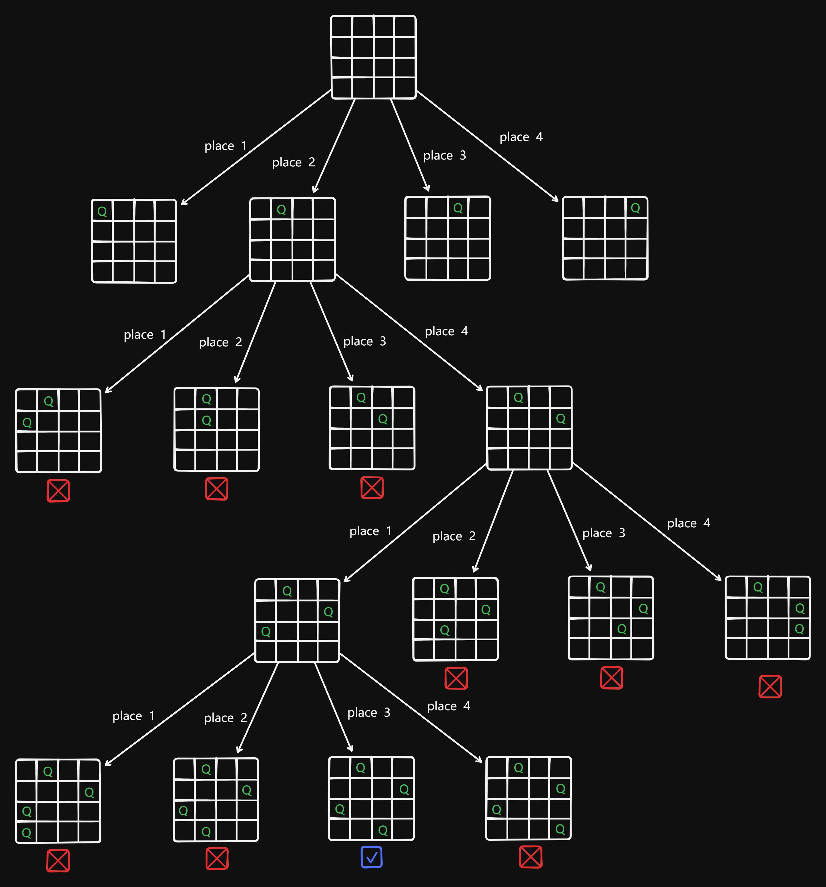
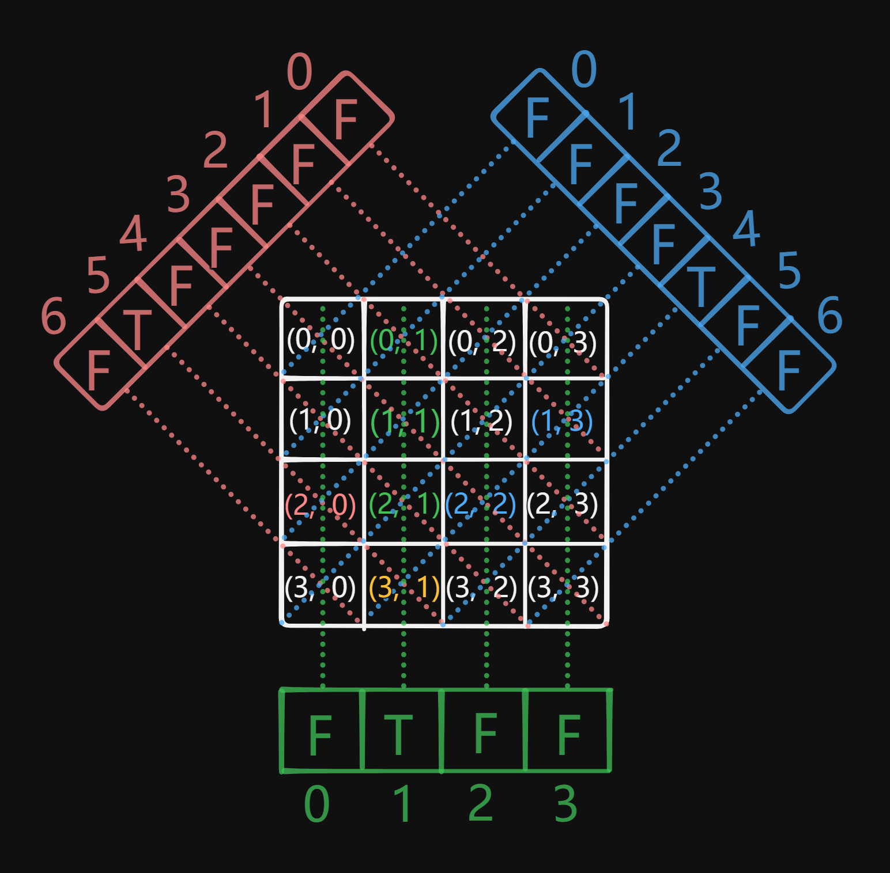

# 51 N-Queens

Created: July 10, 2024 2:29 PM
Select: Hard
Topics: Array, Backtracking

## 📖Description

[N-Queens](https://leetcode.com/problems/n-queens/description)

## 🤔Intuition

It is well known that the N-Queens problem is a classic problem solved by backtracking algorithm. The three constraints of this question are that multiple queens cannot be in the same row, column, and diagonal.

## 📋Approach One

### State-space Tree



### Safety Check

**Implement a helper function** `isValid(row, col, chessboard)` **:**

```tsx
const isValid = (
    row: number,
    col: number,
    chessboard: string[][]
): boolean => {
		// Check straight line upward
    for (let i = 0; i < row; i++) {
        if (chessboard[i][col] === 'Q') {
            return false;
        }
    }
    
		// Check diagonally left
    for (let i = row - 1, j = col - 1; i >= 0 && j >= 0; i--, j--) {
        if (chessboard[i][j] === 'Q') {
            return false;
        }
    }

		// Check diagonally right
    for (let i = row - 1, j = col + 1; i >= 0 && j < n; i--, j++) {
        if (chessboard[i][j] === 'Q') {
            return false;
        }
    }

    return true;
};
```

### Recursive Backtracking

**Implement a recursive function** `backtrack(row, chessboard)` **:**

- If the row index `row` reaches `n` , a valid configuration is found and appended to the `result` .
- Iterate over all `col` , and check if the current position `(row, col)` is valid for placing a queen.
- If `isValid` is `true` , update the `chessboard[row][col]` to `'Q'` , means this index can be placed a queen.
- Recursively call `backtrack` with updated `row + 1` .

## 📊Complexity

- **Time complexity: $O(N! * N^2)$**
- **Space complexity:** $O(N^2)$

## 🧑🏻‍💻Code

```tsx
function solveNQueens(n: number): string[][] {
    const result: string[][] = [];
    const chessboard: string[][] = new Array(n)
        .fill(0)
        .map((_) => new Array(n).fill('.'));

    const isValid = (
        row: number,
        col: number,
        chessboard: string[][]
    ): boolean => {
        for (let i = 0; i < row; i++) {
            if (chessboard[i][col] === 'Q') {
                return false;
            }
        }

        for (let i = row - 1, j = col - 1; i >= 0 && j >= 0; i--, j--) {
            if (chessboard[i][j] === 'Q') {
                return false;
            }
        }

        for (let i = row - 1, j = col + 1; i >= 0 && j < n; i--, j++) {
            if (chessboard[i][j] === 'Q') {
                return false;
            }
        }

        return true;
    };

    const backtrack = (row: number, chessboard: string[][]): void => {
        if (row === n) {
            const tmpArr: string[] = [];
            for (let row of chessboard) {
                tmpArr.push(row.join(''));
            }

            result.push(tmpArr);

            return;
        }

        for (let col = 0; col < n; col++) {
            if (!isValid(row, col, chessboard)) {
                continue;
            }

            chessboard[row][col] = 'Q';
            backtrack(row + 1, chessboard);
            chessboard[row][col] = '.';
        }
    };

    backtrack(0, chessboard);

    return result;
}
```

## 📋Approach Two

The above approach use a `chessboard` for recording the placed queen and checking if the position where the queen is to be placed is valid. However, we also can maintain a Set  `colSet` to record cols that have not yet been placed with queen.

### Safety Check

There is another method to check if this place is safe to place the queen just need one for loop.

**Consider the case shown in the following figure:**


If we're going to place the queen on `(2, 2)` , it will entail all the places of row (less than 2), plus col (less than 2) is equal to 4 and row minus col `(0, 0), (1, 1), (1, 3), (0, 4)` must ensure that the queens are not placed.

**Thus, we can implement this helper function** `isValid(row, col)` **:**

```tsx
const isValid = (row: number, col: number): boolean => {
    for (let r = 0; r < row; r++) {
        const c = column[r]; // column is a number[] to record where the queens are placed

        if (row + col === r + c || row - col === r - c) {
            return false;
        }
    }

    return true;
};
```

### Recursive Backtracking

**Implement a recursive function** `backtrack(r, colSet)` **:**

- If the row index `r` reaches `n` , a valid configuration is found and appended to the `result` .
- Create a Set `colSet` initiated by from `0` to `n` for recording which column hasn't been placed, then iterate over the `c` of `colSet` .
- If `isValid(r, c)` is `true` , update the `column` , and create another Set `s` constructed from `colSet` in current backtracking process, and delete `c` in this `s` .
- Recursively call `backtrack` with updated `r + 1` and `s` .

## 📊Complexity

- **Time complexity: $O(N! * N^2)$**
- **Space complexity: $O(N^2)$**

## 🧑🏻‍💻Code

```tsx
function solveNQueens(n: number): string[][] {
    const result: string[][] = [];
    const column: number[] = new Array(n).fill(0);

    const isValid = (row: number, col: number): boolean => {
        for (let r = 0; r < row; r++) {
            const c = column[r];

            if (row + col === r + c || row - col === r - c) {
                return false;
            }
        }

        return true;
    };

    const backtrack = (r: number, colSet: Set<number>): void => {
        if (r === n) {
            result.push(
                column.map((c) => '.'.repeat(c) + 'Q' + '.'.repeat(n - 1 - c))
            );

            return;
        }

        for (const c of colSet) {
            if (isValid(r, c)) {
                column[r] = c;
                const s = new Set(colSet);
                s.delete(c);
                backtrack(r + 1, s);
            }
        }
    };

    backtrack(0, new Set([...new Array(n).keys()]));

    return result;
}
```

## 📋Optimized Approach One

We can use an Array instead of the Set to improve algorithm performance.

## 📊Complexity

- **Time complexity: $O(N! * N^2)$**
- **Space complexity: $O(N^2)$**

## 🧑🏻‍💻Code

```tsx
function solveNQueens(n: number): string[][] {
    const result: string[][] = [];
    const column: number[] = new Array(n).fill(0);
    const visited: boolean[] = new Array(n).fill(false);

    const isValid = (row: number, col: number): boolean => {
        for (let r = 0; r < row; r++) {
            const c = column[r];

            if (row + col === r + c || row - col === r - c) {
                return false;
            }
        }

        return true;
    };

    const backtrack = (r: number): void => {
        if (r === n) {
            result.push(
                column.map((c) => '.'.repeat(c) + 'Q' + '.'.repeat(n - 1 - c))
            );

            return;
        }

        for (let c = 0; c < n; c++) {
            if (!visited[c] && isValid(r, c)) {
                column[r] = c;
                visited[c] = true;
                backtrack(r + 1);
                visited[c] = false;
            }
        }
    };

    backtrack(0);

    return result;
}
```

## 📋Optimized Approach Two

Consider following figure, we can initialize three arrays to keep track of the columns and diagonals that are already placed queens. They work by the theory of “Safety Check” in the “Approach Two”.



### Recursive Backtracking

**Implement a recursive function** `backtrack(r)` **:**

- If the row index `r` reaches `n` , a valid configuration is found and appended to the `result` .
- Iterate over all `col` , compute the `diagIndex1` and `diagIndex2` , then check if `visited[col]` , `diagonal1[diagIndex1]` and `diagonal2[diagIndex2]` are all `false` .
- If they are all `false`, means this `(row, col)` is safe to place the queen, update `column` and set `visited[col]` , `diagonal1[diagIndex1]` and `diagonal2[diagIndex2]` to be `true` .
- Recursively call `backtrack` with updated `r + 1` .

> The `diagIndex2` can be `r - c` while using JS/TS, because it will not throw an error while using a negative index in an array. For example:
> 
> 
> ```tsx
> const arr: number[] = [1, 2, 3];
> console.log(arr); // [1, 2, 3]
> console.log(arr[-1]); // undefined
> 
> arr[-1] = 4;
> console.log(arr); // [1, 2, 3, -1: 4]
> console.log(arr[-1]); // 4
> ```
> 
> 
> 

## 📊Complexity

- **Time complexity: $O(N! * N^2)$**
- **Space complexity: $O(N^2)$**

## 🧑🏻‍💻Code

```tsx
function solveNQueens(n: number): string[][] {
    const result: string[][] = [];
    const column: number[] = new Array(n).fill(0);
    const visited: boolean[] = new Array(n).fill(false);
    const diagonal1: boolean[] = new Array(2 * n - 1).fill(false);
    const diagonal2: boolean[] = new Array(2 * n - 1).fill(false);

    const backtrack = (r: number): void => {
        if (r === n) {
            result.push(
                column.map((c) => '.'.repeat(c) + 'Q' + '.'.repeat(n - 1 - c))
            );

            return;
        }

        for (let c = 0; c < n; c++) {
            const diagIndex1 = r + c;
            const diagIndex2 = r - c + n - 1; // diagIndex2 can be r - c while using JS/TS
            if (
                !visited[c] &&
                !diagonal1[diagIndex1] &&
                !diagonal2[diagIndex2]
            ) {
                column[r] = c;
                visited[c] =
                    diagonal1[diagIndex1] =
                    diagonal2[diagIndex2] =
                        true;
                backtrack(r + 1);
                visited[c] =
                    diagonal1[diagIndex1] =
                    diagonal2[diagIndex2] =
                        false;
            }
        }
    };

    backtrack(0);

    return result;
}
```

## 🔖Reference

1. [https://programmercarl.com/0051.N皇后.html#思路](https://programmercarl.com/0051.N%E7%9A%87%E5%90%8E.html#%E6%80%9D%E8%B7%AF)
2. [https://www.bilibili.com/video/BV1mY411D7f6](https://www.bilibili.com/video/BV1mY411D7f6/)
3. [https://leetcode.com/problems/n-queens/solutions/5440883/beginner-friendly-approach-using-backtracking-in-cpp/](https://leetcode.com/problems/n-queens/solutions/5440883/beginner-friendly-approach-using-backtracking-in-cpp/?source=vscode)
4. [https://leetcode.com/problems/n-queens/solutions/5442121/optimized-solution-using-hashmaps-and-backtracking](https://leetcode.com/problems/n-queens/solutions/5442121/optimized-solution-using-hashmaps-and-backtracking)
5. [https://leetcode.com/problems/n-queens/solutions/5377440/n-queen-easy-solution/](https://leetcode.com/problems/n-queens/solutions/5377440/n-queen-easy-solution/?source=vscode)
6. [https://www.hello-algo.com/chapter_backtracking/n_queens_problem/#3](https://www.hello-algo.com/chapter_backtracking/n_queens_problem/#3)